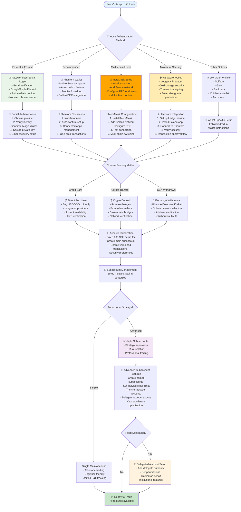
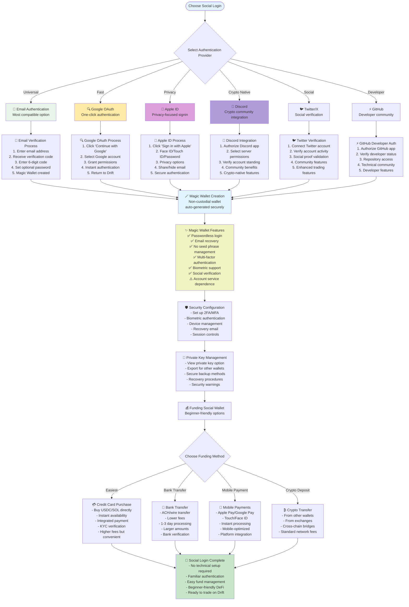
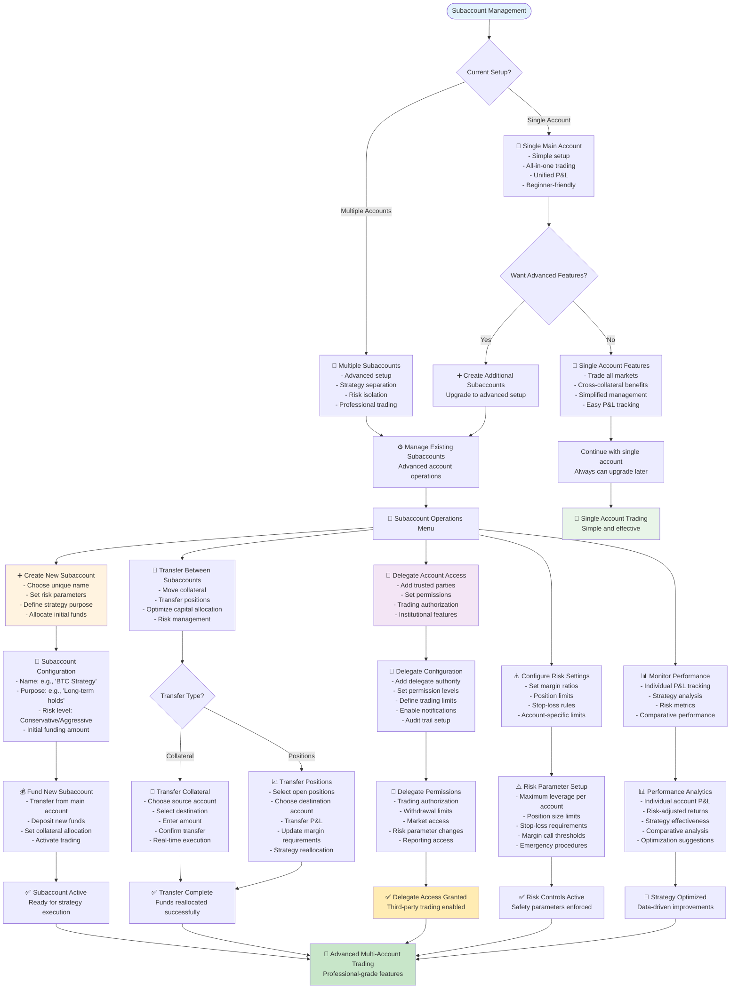
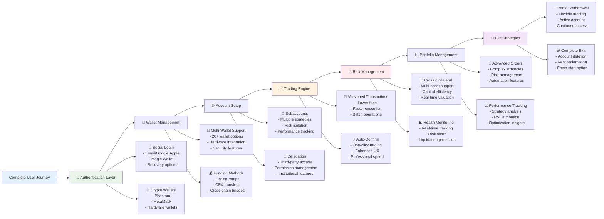

# Drift Protocol Complete User Journey Flows - Advanced Features

Based on official documentation from https://docs.drift.trade/

---

## Complete Onboarding Flow with Advanced Features



## MetaMask Detailed Setup Flow

```mermaid
flowchart TD
    MetaMaskStart([MetaMask Setup for Drift]) --> HasMetaMask{MetaMask Installed?}
    
    HasMetaMask -->|No| InstallMM[📥 Install MetaMask<br/>1. Visit metamask.io<br/>2. Download extension<br/>3. Create/import wallet<br/>4. Secure seed phrase<br/>5. Set strong password]
    
    HasMetaMask -->|Yes| CheckSolana{Solana Network Added?}
    
    InstallMM --> CheckSolana
    
    CheckSolana -->|No| AddSolanaNetwork[🌐 Add Solana Network<br/>Manual configuration required]
    CheckSolana -->|Yes| TestConnection[🔌 Test Connection<br/>Verify Solana functionality]
    
    AddSolanaNetwork --> NetworkConfig[⚙️ Solana Network Configuration<br/>Network Name: Solana Mainnet<br/>RPC URL: https://api.mainnet-beta.solana.com<br/>Chain ID: Leave blank<br/>Symbol: SOL<br/>Block Explorer: https://solscan.io]
    
    NetworkConfig --> SaveNetwork[💾 Save Network Configuration<br/>- Add to MetaMask<br/>- Test connectivity<br/>- Verify SOL balance display]
    
    SaveNetwork --> TestConnection
    
    TestConnection --> ConnectionResult{Connection Status?}
    ConnectionResult -->|Success| MetaMaskReady[✅ MetaMask Ready for Drift<br/>- Solana network active<br/>- SOL balance visible<br/>- Ready to connect]
    
    ConnectionResult -->|Failed| TroubleshootMM[🔧 Troubleshoot Connection<br/>- Check RPC URL<br/>- Verify network settings<br/>- Try alternative RPC<br/>- Contact support if needed]
    
    TroubleshootMM --> NetworkConfig
    
    MetaMaskReady --> ConnectToDrift[🚀 Connect to Drift<br/>1. Visit app.drift.trade<br/>2. Click Connect Wallet<br/>3. Select MetaMask<br/>4. Approve connection<br/>5. Switch to Solana network]
    
    ConnectToDrift --> MMFeatures[🦊 MetaMask Features<br/>✅ Multi-chain portfolio view<br/>✅ Hardware wallet support<br/>✅ Mobile app sync<br/>✅ DApp ecosystem access<br/>⚠️ Manual Solana setup<br/>⚠️ Network switching needed]
    
    MMFeatures --> FundingMM[💰 Funding MetaMask for Drift<br/>Multiple options available]
    
    FundingMM --> FundingMethodMM{Choose Funding Method}
    FundingMethodMM -->|Cross-chain| BridgeToSolana[🌉 Bridge to Solana<br/>- From Ethereum/Polygon<br/>- Use Wormhole/Portal<br/>- Cross-chain swaps<br/>- Bridge fees apply]
    
    FundingMethodMM -->|Direct Purchase| BuySOL[💳 Buy SOL Direct<br/>- In-wallet purchase<br/>- Credit card/bank<br/>- Instant availability<br/>- Higher fees]
    
    FundingMethodMM -->|CEX Transfer| CEXToMM[🏦 CEX to MetaMask<br/>- Withdraw from exchange<br/>- Select Solana network<br/>- Verify address<br/>- Lower fees]
    
    BridgeToSolana --> MMComplete[🎉 MetaMask Setup Complete<br/>Ready for Drift trading]
    BuySOL --> MMComplete
    CEXToMM --> MMComplete
    
    style MetaMaskStart fill:#e3f2fd
    style MMComplete fill:#c8e6c9
    style AddSolanaNetwork fill:#fff3e0
    style TroubleshootMM fill:#ffebee
    style MMFeatures fill:#ffa500
```



## Passwordless Social Login Flow



## Advanced Subaccount Management Flow



## Versioned Transactions & Advanced Features

```mermaid
flowchart TD
    AdvancedFeatures([Advanced Trading Features]) --> VersionedTx[🔄 Versioned Transactions<br/>Enhanced transaction efficiency]
    
    VersionedTx --> TxBenefits[✨ Transaction Benefits<br/>- Lower fees<br/>- Faster execution<br/>- Higher success rate<br/>- Batch operations<br/>- Complex multi-step trades]
    
    TxBenefits --> TxConfiguration[⚙️ Transaction Configuration<br/>Auto-enabled for all users<br/>Transparent optimization]
    
    TxConfiguration --> AutoConfirm{Auto-Confirm Available?}
    AutoConfirm -->|Phantom| PhantomAutoConfirm[🦄 Phantom Auto-Confirm<br/>1. Phantom Settings<br/>2. Connected Apps<br/>3. Select Drift<br/>4. Toggle Auto-Confirm<br/>5. One-click trading]
    
    AutoConfirm -->|Other Wallets| ManualConfirm[✋ Manual Confirmation<br/>- Sign each transaction<br/>- Review before approval<br/>- Maximum security<br/>- Slower execution]
    
    PhantomAutoConfirm --> TradingEfficiency[⚡ Enhanced Trading Efficiency<br/>- Instant order execution<br/>- Reduced clicks<br/>- Seamless experience<br/>- Professional-grade speed]
    
    ManualConfirm --> SecurityFirst[🔒 Security-First Trading<br/>- Review every transaction<br/>- Prevent mistakes<br/>- Educational approach<br/>- Conscious decision making]
    
    TradingEfficiency --> AdvancedOrders[📋 Advanced Order Types<br/>Complex trading strategies]
    SecurityFirst --> AdvancedOrders
    
    AdvancedOrders --> OrderTypes[🎯 Available Order Types<br/>- Market orders<br/>- Limit orders<br/>- Stop loss orders<br/>- Take profit orders<br/>- Trailing stops<br/>- Conditional orders<br/>- Iceberg orders<br/>- Time-based orders]
    
    OrderTypes --> BatchOperations[📦 Batch Operations<br/>- Multiple orders at once<br/>- Portfolio rebalancing<br/>- Risk management<br/>- Strategy execution<br/>- Capital efficiency]
    
    BatchOperations --> CrossCollateral[💎 Cross-Collateral Benefits<br/>- Use any asset as collateral<br/>- Capital efficiency<br/>- Simplified margin management<br/>- Risk optimization]
    
    CrossCollateral --> SupportedAssets[🪙 Supported Collateral Assets<br/>- USDC (primary)<br/>- SOL (native)<br/>- BTC (wrapped)<br/>- ETH (wrapped)<br/>- Additional tokens<br/>- Real-time valuations]
    
    SupportedAssets --> RiskEngine[⚠️ Advanced Risk Engine<br/>- Real-time monitoring<br/>- Account health tracking<br/>- Liquidation protection<br/>- Margin optimization<br/>- Risk alerts]
    
    RiskEngine --> HealthMonitoring[📊 Account Health Monitoring<br/>- Health ratio display<br/>- Risk level indicators<br/>- Margin requirements<br/>- Liquidation warnings<br/>- Proactive alerts]
    
    HealthMonitoring --> TradingReady[🚀 Advanced Trading Ready<br/>All features optimized<br/>Professional-grade platform]
    
    style AdvancedFeatures fill:#e3f2fd
    style TradingReady fill:#c8e6c9
    style PhantomAutoConfirm fill:#dda0dd
    style TradingEfficiency fill:#e8f5e8
    style SecurityFirst fill:#fff3e0
    style RiskEngine fill:#ffebee
```

## Account Management & Exit Strategies

```mermaid
flowchart TD
    AccountMgmt([Account Management Options]) --> ManagementChoice{Choose Management Action}
    
    ManagementChoice -->|Optimize| OptimizeAccount[⚙️ Account Optimization<br/>- Review performance<br/>- Adjust strategies<br/>- Rebalance portfolio<br/>- Update risk settings]
    
    ManagementChoice -->|Withdraw| WithdrawFunds[💸 Withdraw Funds<br/>- Partial withdrawal<br/>- Keep account active<br/>- Maintain trading access<br/>- Flexible funding]
    
    ManagementChoice -->|Pause| PauseTrading[⏸️ Pause Trading<br/>- Close all positions<br/>- Keep account open<br/>- Withdraw most funds<br/>- Maintain minimal balance]
    
    ManagementChoice -->|Exit| ExitStrategy[🚪 Complete Exit Strategy<br/>- Close all positions<br/>- Withdraw all funds<br/>- Delete account<br/>- Reclaim rent]
    
    OptimizeAccount --> OptimizationOptions[🎯 Optimization Options<br/>- Performance analysis<br/>- Strategy refinement<br/>- Risk adjustment<br/>- Capital allocation<br/>- Feature utilization]
    
    WithdrawFunds --> WithdrawChecks[✅ Withdrawal Prerequisites<br/>- Sufficient free collateral<br/>- No open positions (for full)<br/>- Settled P&L<br/>- Account health check]
    
    WithdrawChecks --> WithdrawProcess[💰 Withdrawal Process<br/>1. Select withdrawal amount<br/>2. Choose destination<br/>3. Confirm transaction<br/>4. Pay network fees<br/>5. Receive confirmation]
    
    PauseTrading --> PauseSteps[⏸️ Pause Trading Steps<br/>1. Close all open positions<br/>2. Settle unsettled P&L<br/>3. Withdraw excess funds<br/>4. Keep minimum balance<br/>5. Account remains active]
    
    ExitStrategy --> ExitPrerequisites[📋 Exit Prerequisites Check<br/>- Close all positions<br/>- Settle all P&L<br/>- Clear all borrows<br/>- Withdraw all balances<br/>- Cancel limit orders]
    
    ExitPrerequisites --> ExitChecklist{Exit Requirements Met?}
    ExitChecklist -->|No| ResolveIssues[🔧 Resolve Outstanding Issues<br/>- Close remaining positions<br/>- Settle pending P&L<br/>- Repay any borrows<br/>- Clear all balances<br/>- Cancel pending orders]
    
    ExitChecklist -->|Yes| AccountDeletion[🗑️ Account Deletion Process<br/>Safe to proceed with deletion]
    
    ResolveIssues --> ExitChecklist
    
    AccountDeletion --> DeletionOptions[🚪 Deletion Options<br/>- Single subaccount deletion<br/>- Complete account deletion<br/>- Rent reclamation<br/>- Data export options]
    
    DeletionOptions --> RentReclaim[💰 Rent Reclamation<br/>- Base rent: ~0.035 SOL<br/>- Excess fees (if applicable)<br/>- 7-day waiting period for excess<br/>- Instant base rent return<br/>- Automatic to wallet]
    
    RentReclaim --> ConfirmDeletion[⚠️ Confirm Deletion<br/>- Permanent action warning<br/>- Data loss notification<br/>- Account history deletion<br/>- No recovery possible<br/>- Final confirmation required]
    
    ConfirmDeletion --> DeletionComplete[✅ Account Deleted Successfully<br/>- Rent returned to wallet<br/>- Account permanently closed<br/>- Data cleared from system<br/>- Can create new account anytime]
    
    OptimizationOptions --> ContinueTrading[📈 Continue Optimized Trading<br/>Improved strategy execution]
    WithdrawProcess --> FlexibleAccount[💎 Flexible Account Management<br/>Funds withdrawn, account active]
    PauseSteps --> PausedAccount[⏸️ Account Paused<br/>Ready to resume when needed]
    
    DeletionComplete --> FutureOptions[🔄 Future Options<br/>- Create new account anytime<br/>- Same wallet, fresh start<br/>- No restrictions<br/>- Previous history cleared<br/>- Standard setup fees apply]
    
    style AccountMgmt fill:#e3f2fd
    style ContinueTrading fill:#c8e6c9
    style FlexibleAccount fill:#e8f5e8
    style PausedAccount fill:#fff3e0
    style DeletionComplete fill:#ffcdd2
    style FutureOptions fill:#f0f4c3
    style ConfirmDeletion fill:#ffebee
    style ExitStrategy fill:#fff3e0
```

## Complete Feature Integration Map



---

## Implementation Guide

### Key Features Covered:
1. **Complete Wallet Support** - Social login, Phantom, MetaMask, hardware wallets
2. **MetaMask Integration** - Detailed Solana network setup and configuration
3. **Passwordless Authentication** - Magic wallet, social providers, email verification
4. **Advanced Subaccounts** - Multiple strategies, risk isolation, delegation
5. **Versioned Transactions** - Optimized performance, lower fees, batch operations
6. **Auto-Confirm Features** - One-click trading, enhanced UX
7. **Risk Management** - Cross-collateral, health monitoring, liquidation protection
8. **Account Management** - Withdrawal options, account closure, rent reclamation

### Technical Implementation Notes:
- **MetaMask Solana Setup**: Manual network configuration required
- **Social Login**: Magic wallet integration with email recovery
- **Subaccounts**: Numbered accounts (0, 1, 2...) with individual settings
- **Delegated Accounts**: Authority mapping for institutional use
- **Versioned Transactions**: Automatically enabled, transparent to users
- **Account Deletion**: Permanent action with rent reclamation

### Security Considerations:
- **Progressive Security**: Start simple, upgrade as needed
- **Multi-Factor Authentication**: Available with social login
- **Hardware Wallet Integration**: Maximum security for large amounts
- **Risk Parameter Controls**: Individual and account-level limits
- **Audit Trails**: Complete transaction and delegation history

These comprehensive flowcharts now include all advanced Drift Protocol features, providing complete coverage of the user journey from basic signup to professional-grade trading with institutional features.