# Drift Protocol - Crisp Onboarding Flow

**From Wallet Connect to First Trade Completion**

---

## Streamlined Onboarding: Wallet to Trade

```mermaid
flowchart TD
    Start([Visit app.drift.trade]) --> ConnectWallet[🔗 Connect Wallet<br/>Click 'Connect Wallet' button]
    
    ConnectWallet --> WalletChoice{Choose Wallet}
    WalletChoice -->|Email| EmailLogin[📧 Email Login<br/>Enter email → Verify code<br/>Magic Wallet created]
    WalletChoice -->|Phantom| PhantomConnect[🦄 Phantom<br/>Select wallet → Sign message<br/>Connection authorized]
    WalletChoice -->|MetaMask| MetaMaskConnect[🦊 MetaMask<br/>Add Solana network → Connect<br/>Sign authorization]
    
    EmailLogin --> PaySetupFee[💰 Pay Setup Fee<br/>0.035 SOL one-time cost<br/>Creates Drift account]
    PhantomConnect --> PaySetupFee
    MetaMaskConnect --> PaySetupFee
    
    PaySetupFee --> DepositFunds[💵 Deposit Funds<br/>Minimum $100 recommended<br/>USDC suggested for beginners]
    
    DepositFunds --> AccountReady[✅ Account Ready<br/>Balance: $500 USDC<br/>Ready to trade]
    
    AccountReady --> SelectMarket[🎯 Select Market<br/>Choose SOL-PERP<br/>Most liquid market]
    
    SelectMarket --> ViewMarketData[📊 Market Data<br/>SOL Price: $201.05<br/>24h Volume: $1.04M<br/>Funding: 0.0012%]
    
    ViewMarketData --> ChooseDirection{Trade Direction}
    ChooseDirection -->|Bullish| GoLong[📈 Go Long<br/>Buy SOL-PERP<br/>Expecting price increase]
    ChooseDirection -->|Bearish| GoShort[📉 Go Short<br/>Sell SOL-PERP<br/>Expecting price decrease]
    
    GoLong --> SetPosition[⚙️ Set Position Parameters<br/>Size: $200 (40% of balance)<br/>Leverage: 5x<br/>Margin: $40]
    GoShort --> SetPosition
    
    SetPosition --> PlaceOrder[📋 Place Market Order<br/>Execute immediately<br/>at current price]
    
    PlaceOrder --> OrderExecution[⚡ Drift Execution<br/>JIT Auction (5 seconds)<br/>Best price discovery]
    
    OrderExecution --> PositionFilled[✅ Position Filled<br/>Entry: $200.98<br/>Size: 0.99 SOL<br/>Leverage: 5x]
    
    PositionFilled --> MonitorPosition[📊 Monitor Position<br/>Real-time P&L tracking<br/>Current: +$2.47<br/>Health: 92%]
    
    MonitorPosition --> PositionUpdate[📈 Position Update<br/>SOL moves to $203.25<br/>Unrealized P&L: +$4.48<br/>Time to close]
    
    PositionUpdate --> ClosePosition[🚪 Close Position<br/>Click 'Close Position'<br/>Market order to exit]
    
    ClosePosition --> PositionClosed[✅ Position Closed<br/>Exit: $203.25<br/>Profit: +$4.48<br/>Fees: -$0.40<br/>Net: +$4.08]
    
    PositionClosed --> TradeComplete[🎉 First Trade Complete!<br/>Account: $504.08<br/>ROI: +0.82%<br/>Duration: 1h 15m]
    
    style Start fill:#e3f2fd
    style TradeComplete fill:#c8e6c9
    style PaySetupFee fill:#fff3e0
    style PositionFilled fill:#e8f5e8
    style PositionClosed fill:#c8e6c9
    style OrderExecution fill:#ffeaa7
```

## Quick Start Checklist

```mermaid
flowchart LR
    Checklist([Quick Start Checklist]) --> Step1[✅ 1. Connect Wallet<br/>Email/Phantom/MetaMask]
    
    Step1 --> Step2[✅ 2. Pay Setup Fee<br/>0.035 SOL one-time]
    
    Step2 --> Step3[✅ 3. Deposit Funds<br/>$100+ USDC recommended]
    
    Step3 --> Step4[✅ 4. Select SOL-PERP<br/>Most beginner-friendly]
    
    Step4 --> Step5[✅ 5. Place Market Order<br/>$200 position, 5x leverage]
    
    Step5 --> Step6[✅ 6. Monitor & Close<br/>Take profit when ready]
    
    Step6 --> Complete[🎉 Trading Activated!<br/>You're now a Drift trader]
    
    style Checklist fill:#e3f2fd
    style Complete fill:#c8e6c9
```



## Time & Cost Breakdown

```mermaid
flowchart TD
    TimeBreakdown([Onboarding Timeline]) --> Phase1[⏱️ Setup Phase<br/>2-5 minutes<br/>Wallet + Account creation]
    
    Phase1 --> Phase2[⏱️ Funding Phase<br/>1-10 minutes<br/>Deposit varies by method]
    
    Phase2 --> Phase3[⏱️ First Trade<br/>30 seconds<br/>Order to execution]
    
    Phase3 --> Phase4[⏱️ Position Management<br/>Variable<br/>Monitor until close]
    
    TimeBreakdown --> CostBreakdown([Cost Structure])
    
    CostBreakdown --> Cost1[💰 Setup Fee<br/>0.035 SOL (~$7)<br/>One-time only]
    
    Cost1 --> Cost2[💰 Trading Fees<br/>0.1% per trade<br/>$0.20 on $200 position]
    
    Cost2 --> Cost3[💰 Funding Fees<br/>Hourly payments<br/>~0.001% if applicable]
    
    Cost3 --> TotalCost[💰 Total First Trade<br/>~$7.40 all-in costs<br/>Then $0.20 per trade]
    
    style TimeBreakdown fill:#e3f2fd
    style CostBreakdown fill:#fff3e0
    style TotalCost fill:#c8e6c9
```

---

## Summary: 6-Step Onboarding

### **⚡ Ultra-Fast Path (30 seconds to trade):**
1. **Connect** → Email login or Phantom wallet
2. **Pay** → 0.035 SOL setup fee  
3. **Deposit** → $100+ USDC
4. **Select** → SOL-PERP market
5. **Trade** → $200 position, 5x leverage
6. **Close** → Take profit when ready

### **💰 All-in Costs:**
- **Setup**: ~$7 (one-time)
- **Trading**: 0.1% per trade
- **Total first trade**: ~$7.40

### **⏱️ Total Time:**
- **Fastest**: 3 minutes (with existing wallet)
- **Typical**: 5-10 minutes (new user)
- **First trade**: 30 seconds to execute

This streamlined flow gets users from discovery to their first completed trade in under 10 minutes!