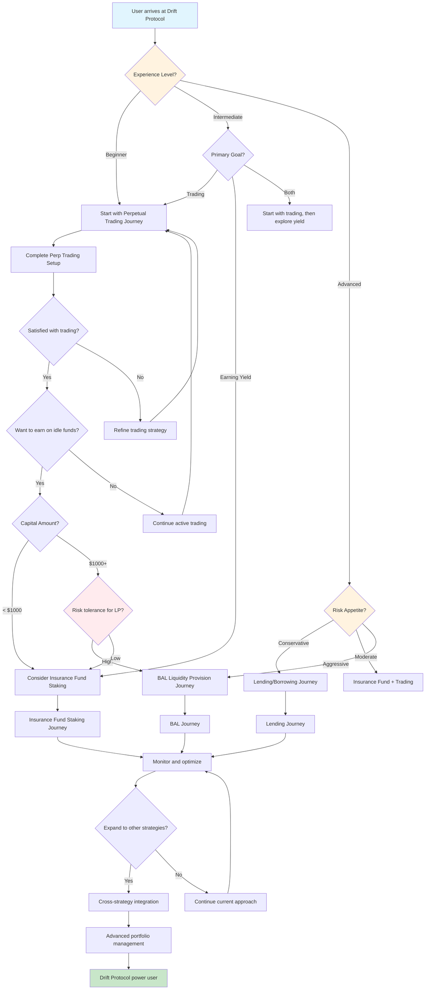
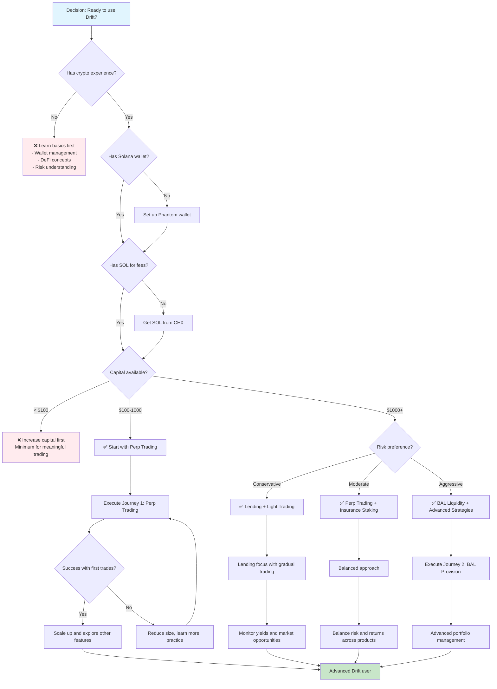
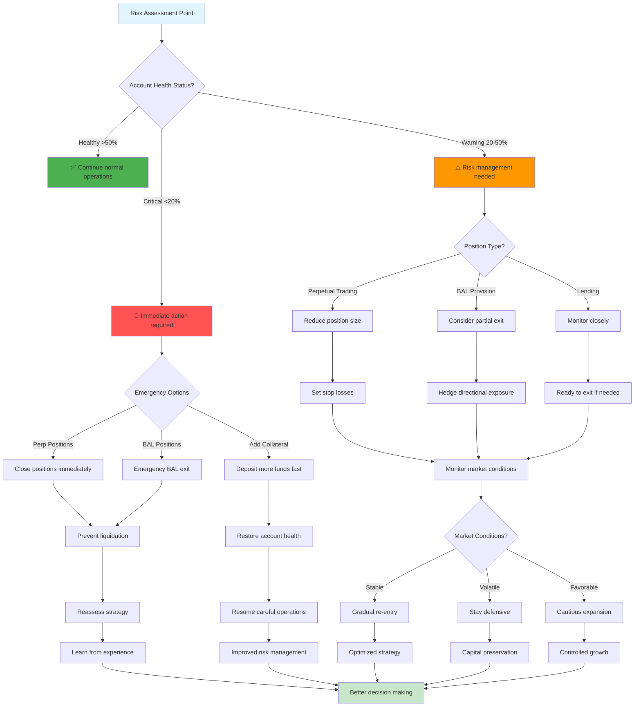
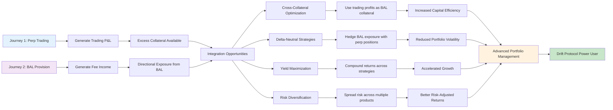

# Drift Protocol User Journey Flows - Mermaid Charts

Based on official documentation from https://docs.drift.trade/ and https://app.drift.trade

---

## User Journey Flow 1: Trading Perpetuals on Drift Protocol

```mermaid
flowchart TD
    A[Start: User wants to trade perps] --> B{Has Solana wallet?}
    
    B -->|No| C[Download Phantom Wallet]
    B -->|Yes| F[Check SOL balance]
    
    C --> D[Install browser extension]
    D --> E[Create wallet & secure seed phrase]
    E --> F
    
    F --> G{Has enough SOL?}
    G -->|No| H[Buy SOL on CEX]
    G -->|Yes| I[Navigate to app.drift.trade]
    
    H --> H1[Withdraw SOL to wallet]
    H1 --> I
    
    I --> J[Click 'Connect Wallet']
    J --> K[Select Phantom & sign message]
    K --> L[Pay 0.035 SOL setup fee]
    
    L --> M[Click 'Deposit' button]
    M --> N[Choose asset: USDC/SOL/BTC/ETH]
    N --> O[Enter deposit amount]
    O --> P[Confirm transaction]
    
    P --> Q[Review 'Overview' tab]
    Q --> R[Check account health & free collateral]
    R --> S[Navigate to 'Markets' section]
    
    S --> T[Analyze available perp markets]
    T --> U[Review market data:<br/>- Oracle vs Mark price<br/>- 24h volume<br/>- Funding rates<br/>- Open interest]
    U --> V[Select market e.g. SOL-PERP]
    
    V --> W[Determine trade direction:<br/>Long bullish or Short bearish]
    W --> X[Calculate position size]
    X --> Y[Choose leverage 1x-101x]
    Y --> Z[Select order type]
    
    Z --> AA{Order Type?}
    AA -->|Market| BB[Set position size & leverage]
    AA -->|Limit| CC[Set target price + size + leverage]
    AA -->|Stop Loss/Take Profit| DD[Set trigger conditions]
    
    BB --> EE[Review trade summary]
    CC --> EE
    DD --> EE
    
    EE --> FF[Check:<br/>- Entry price estimate<br/>- Trading fees ~0.1%<br/>- Resulting leverage<br/>- Margin requirement]
    FF --> GG[Confirm transaction]
    
    GG --> HH[Order enters 5-sec Dutch auction JIT]
    HH --> II{Market makers bid?}
    
    II -->|Yes| JJ[Order filled by best JIT bid]
    II -->|No| KK{Limit orders available?}
    
    KK -->|Yes| LL[Matched with DLOB limit order]
    KK -->|No| MM[Filled against AMM]
    
    JJ --> NN[Position opened - Monitor in 'Positions' tab]
    LL --> NN
    MM --> NN
    
    NN --> OO[Track real-time:<br/>- Unrealized P&L<br/>- Mark price changes<br/>- Funding payments<br/>- Account health]
    
    OO --> PP{Want to adjust position?}
    PP -->|Yes| QQ[Options:<br/>- Increase position<br/>- Reduce position<br/>- Set stop-loss<br/>- Take profit order]
    PP -->|No| RR{Ready to close?}
    
    QQ --> OO
    
    RR -->|No| OO
    RR -->|Yes| SS[Navigate to open position]
    
    SS --> TT[Click 'Close' button]
    TT --> UU{Close type?}
    
    UU -->|Full| VV[Close entire position]
    UU -->|Partial| WW[Close specific amount]
    
    VV --> XX[Review closing price & fees]
    WW --> XX
    
    XX --> YY[Confirm transaction]
    YY --> ZZ[P&L settled to account balance]
    
    ZZ --> AAA[Check 'History' tab for trade details]
    AAA --> BBB[Analyze performance:<br/>- Total ROI<br/>- Fees paid<br/>- Time in position<br/>- Learning points]
    
    BBB --> CCC[End: Trade completed]
    
    style A fill:#e1f5fe
    style CCC fill:#c8e6c9
    style HH fill:#fff3e0
    style II fill:#fff3e0
    style KK fill:#fff3e0
```

---

## User Journey Flow 2: Providing Liquidity via Backstop AMM Liquidity (BAL)

```mermaid
flowchart TD
    A[Start: Advanced user wants to provide liquidity] --> B{Has Drift account?}
    
    B -->|No| C[Complete Journey 1 first]
    B -->|Yes| D[Read BAL documentation]
    
    C --> D
    
    D --> E[Understand key concepts:<br/>- BAL Shares<br/>- Pro-rata positions<br/>- K-adjustment<br/>- Revenue sharing]
    
    E --> F[Learn risk factors:<br/>- Directional exposure<br/>- Potential liquidation<br/>- Smart contract risk]
    
    F --> G[Analyze available BAL markets]
    G --> H[Review for each market:<br/>- Current BAL TVL<br/>- Trading volume<br/>- Fee generation<br/>- Market volatility<br/>- Funding patterns]
    
    H --> I[Consider portfolio correlation]
    I --> J[Calculate optimal position size]
    
    J --> K[Plan capital allocation:<br/>- Risk tolerance<br/>- Diversification needs<br/>- Liquidity requirements<br/>- Expected APY vs alternatives]
    
    K --> L[Navigate to app.drift.trade]
    L --> M[Go to 'Earn' section]
    M --> N[Select 'Backstop AMM Liquidity BAL']
    
    N --> O[Review available markets & yields]
    O --> P[Click chosen market for details]
    
    P --> Q[Review current AMM state:<br/>- K-value liquidity depth<br/>- Base/quote reserves<br/>- Mark vs oracle price<br/>- Existing BAL providers]
    
    Q --> R[Calculate LP parameters:<br/>- Required collateral<br/>- BAL share percentage<br/>- Expected directional exposure<br/>- Estimated yield]
    
    R --> S[Specify LP amount in USD]
    S --> T[Review transaction details:<br/>- BAL shares to receive<br/>- Pro-rata position assigned<br/>- Entry mark price<br/>- Expected fees]
    
    T --> U[⚠️ Understand: You inherit<br/>AMM's current directional bias]
    U --> V[Confirm transaction & sign]
    
    V --> W[Position opened - Monitor in 'Positions' tab]
    
    W --> X[Track BAL performance:<br/>- Share value changes<br/>- Assigned perp position P&L<br/>- Fee earnings accumulation<br/>- AMM k-value share]
    
    X --> Y[Calculate metrics:<br/>- Total return fees + P&L<br/>- APY based on time<br/>- Market share percentage]
    
    Y --> Z[Monitor account health]
    Z --> AA[Watch for risks:<br/>- Large directional moves<br/>- Volatility changes<br/>- AMM rebalancing<br/>- K-adjustments]
    
    AA --> BB{Risk management needed?}
    BB -->|Yes| CC[Risk controls:<br/>- Set position alerts<br/>- Consider external hedging<br/>- Plan exit strategies]
    BB -->|No| DD[Optimization strategies]
    
    CC --> DD
    
    DD --> EE[Rebalancing options:<br/>- Adjust allocations by fees<br/>- React to market conditions<br/>- Seek better opportunities]
    
    EE --> FF[Compounding: Reinvest fees]
    FF --> GG[Diversification across markets]
    GG --> HH[Timing: Monitor cycles]
    
    HH --> II{Want advanced strategies?}
    
    II -->|Yes| JJ[Delta-neutral hedging:<br/>- Calculate directional exposure<br/>- Open offsetting positions<br/>- Goal: Isolate fee earning]
    II -->|No| MM[Continue basic monitoring]
    
    JJ --> KK[Cross-strategy integration:<br/>- Lending unused collateral<br/>- Insurance fund staking<br/>- JIT market making<br/>- Subaccount separation]
    
    KK --> LL[Performance analysis:<br/>- Fee APY vs projections<br/>- Impermanent loss/gain<br/>- Risk-adjusted returns<br/>- Compare alternatives]
    
    LL --> MM
    MM --> NN{Time to exit?}
    
    NN -->|No| X
    NN -->|Yes| OO[Monitor exit signals:<br/>- Declining fees<br/>- Poor market conditions<br/>- Better opportunities<br/>- Risk requirements]
    
    OO --> PP[Consider timing:<br/>- Market volatility<br/>- Funding cycles<br/>- Personal liquidity needs]
    
    PP --> QQ[Navigate to BAL position]
    QQ --> RR[Select 'Withdraw' or 'Reduce']
    RR --> SS{Exit type?}
    
    SS -->|Partial| TT[Specify partial amount]
    SS -->|Full| UU[Exit entire position]
    
    TT --> VV[Review exit terms]
    UU --> VV
    
    VV --> WW[Check:<br/>- Current BAL share value<br/>- Position P&L settlement<br/>- Accumulated fee rewards<br/>- Total return calculation]
    
    WW --> XX[Confirm transaction & sign]
    XX --> YY[Final settlement:<br/>- Verify positions closed<br/>- Claim remaining fees<br/>- Settle unsettled P&L]
    
    YY --> ZZ{Withdraw funds?}
    ZZ -->|Yes| AAA[Withdraw to external wallet]
    ZZ -->|No| BBB[Keep in Drift account]
    
    AAA --> CCC[Document for tax reporting]
    BBB --> CCC
    
    CCC --> DDD[Performance review:<br/>- Calculate total returns<br/>- Fee income + position P&L<br/>- Opportunity cost analysis<br/>- Lessons learned]
    
    DDD --> EEE[Strategy refinement:<br/>- Market selection criteria<br/>- Position sizing methodology<br/>- Risk management improvements<br/>- DeFi strategy integration]
    
    EEE --> FFF[End: BAL journey completed]
    
    style A fill:#e1f5fe
    style FFF fill:#c8e6c9
    style U fill:#ffebee
    style BB fill:#fff3e0
    style II fill:#f3e5f5
    style NN fill:#fff3e0
```

---

## Combined High-Level User Journey Decision Tree

---

## Key Decision Points Flowchart

---

## Risk Management Decision Tree

---

## Integration Points Between Journeys

---

*These Mermaid flowcharts visualize the complete user journeys for Drift Protocol based on official documentation. Copy and paste any of these into a Mermaid-compatible editor or documentation system to render the interactive flowcharts.*