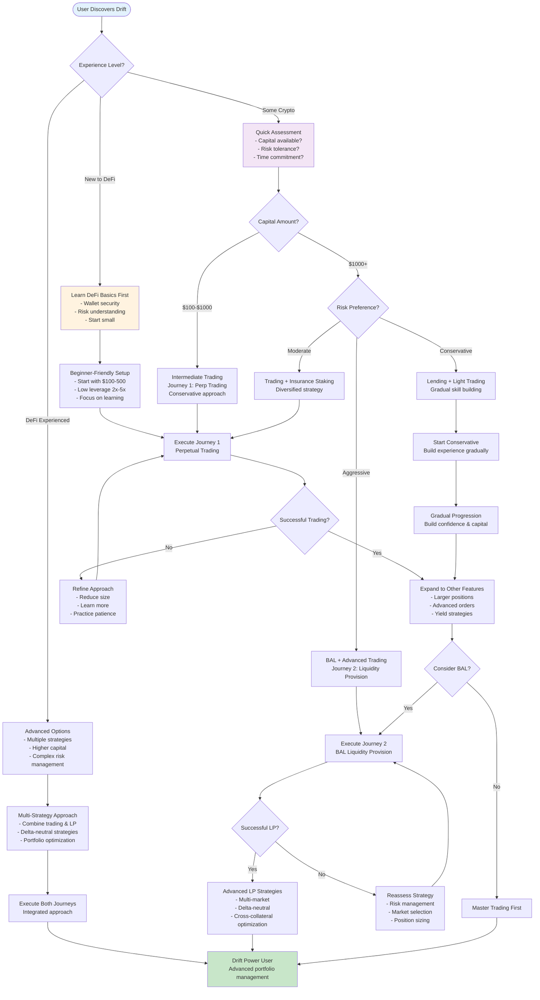
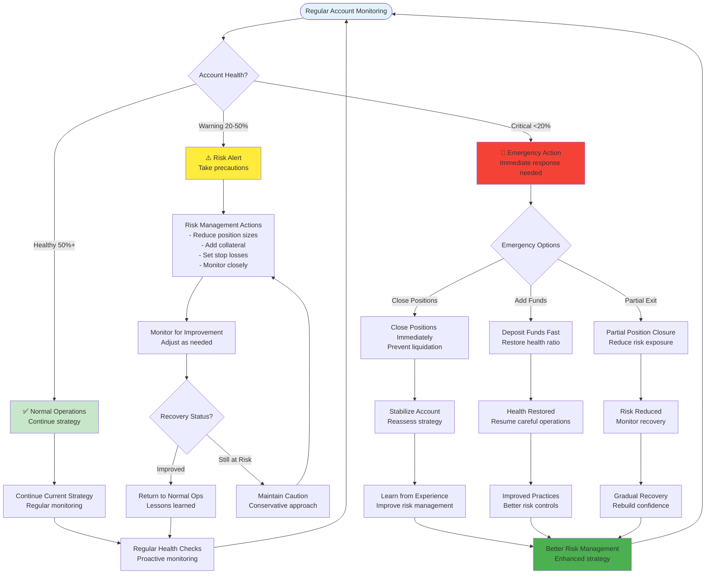
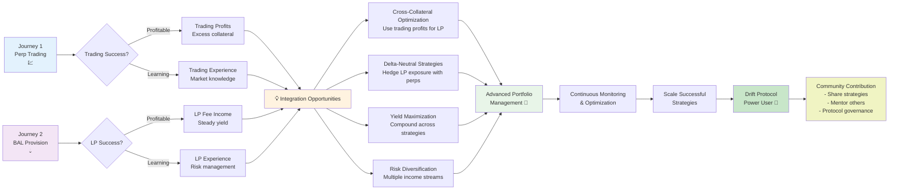
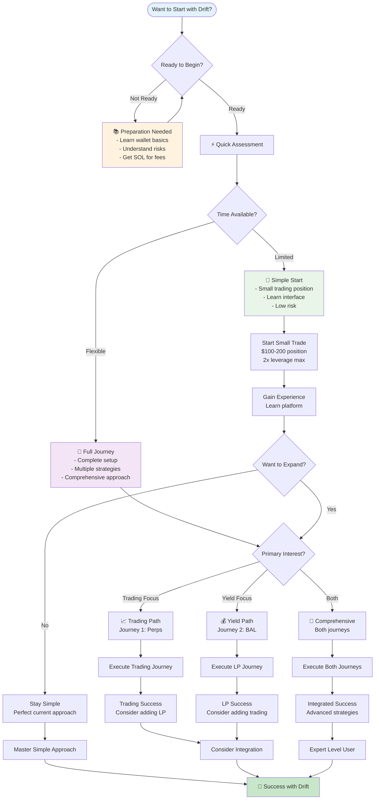

# Drift Protocol User Journey Flows - Mermaid Implementation

## Journey 1: Perpetual Trading Flow

```mermaid
flowchart TD
    Start([New User Wants to Trade Perps]) --> WalletCheck{Has Solana Wallet?}
    
    WalletCheck -->|No| CreateWallet[Create Phantom Wallet<br/>- Download extension<br/>- Secure seed phrase]
    WalletCheck -->|Yes| CheckSOL{Has SOL for fees?}
    
    CreateWallet --> GetSOL[Get SOL<br/>- Buy on CEX<br/>- Withdraw to wallet]
    CheckSOL -->|No| GetSOL
    CheckSOL -->|Yes| ConnectDrift[Connect to app.drift.trade]
    
    GetSOL --> ConnectDrift
    ConnectDrift --> WalletConnect[Connect Wallet<br/>- Sign message<br/>- Pay 0.035 SOL setup]
    
    WalletConnect --> Deposit[Deposit Collateral<br/>- USDC recommended<br/>- Min $100-500]
    Deposit --> CheckBalance[Verify Account Balance<br/>& Free Collateral]
    
    CheckBalance --> SelectMarket[Choose Perp Market<br/>- SOL-PERP popular<br/>- Analyze volume & funding]
    SelectMarket --> PlanTrade[Plan Trade<br/>- Direction: Long/Short<br/>- Position size<br/>- Leverage 1x-101x]
    
    PlanTrade --> OrderType{Select Order Type}
    OrderType -->|Market| PlaceMarket[Market Order<br/>- Immediate execution<br/>- Set size & leverage]
    OrderType -->|Limit| PlaceLimit[Limit Order<br/>- Set price target<br/>- Set size & leverage]
    OrderType -->|Advanced| PlaceAdvanced[Stop Loss/Take Profit<br/>- Risk management]
    
    PlaceMarket --> ReviewOrder[Review Trade Summary<br/>- Entry price<br/>- Fees ~0.1%<br/>- Margin required]
    PlaceLimit --> ReviewOrder
    PlaceAdvanced --> ReviewOrder
    
    ReviewOrder --> ConfirmTrade[Confirm Transaction]
    ConfirmTrade --> JITAuction[5-Second JIT Auction<br/>Market makers compete]
    
    JITAuction --> ExecutionPath{Execution Route}
    ExecutionPath -->|JIT Fill| JITFill[Filled by Market Maker<br/>Better price]
    ExecutionPath -->|DLOB Match| DLOBFill[Matched with Limit Order]
    ExecutionPath -->|AMM Fill| AMMFill[Filled against AMM<br/>Guaranteed liquidity]
    
    JITFill --> MonitorPosition[Position Active<br/>Monitor in Positions tab]
    DLOBFill --> MonitorPosition
    AMMFill --> MonitorPosition
    
    MonitorPosition --> TrackMetrics[Track Real-time<br/>- Unrealized P&L<br/>- Funding payments<br/>- Account health]
    
    TrackMetrics --> ManagePosition{Manage Position?}
    ManagePosition -->|Adjust| AdjustOptions[- Increase size<br/>- Reduce size<br/>- Set stop-loss<br/>- Take profit]
    ManagePosition -->|Hold| ContinueMonitor[Continue Monitoring]
    ManagePosition -->|Close| ClosePosition[Close Position<br/>- Full or partial<br/>- Review exit price]
    
    AdjustOptions --> TrackMetrics
    ContinueMonitor --> TrackMetrics
    ClosePosition --> SettlePNL[Settle P&L<br/>Update account balance]
    
    SettlePNL --> AnalyzePerformance[Analyze Trade<br/>- Total return<br/>- Fees paid<br/>- Learning points]
    AnalyzePerformance --> Complete([Trading Journey Complete])
    
    style Start fill:#e3f2fd
    style Complete fill:#c8e6c9
    style JITAuction fill:#fff3e0
    style ExecutionPath fill:#f3e5f5
```

## Journey 2: Liquidity Provision (BAL) Flow

```mermaid
flowchart TD
    Start([Advanced User - Provide Liquidity]) --> Prerequisites{Ready for BAL?}
    
    Prerequisites -->|No| Learn[Learn Requirements<br/>- Drift account needed<br/>- Understand impermanent loss<br/>- $1000+ recommended]
    Prerequisites -->|Yes| Research[Research BAL Mechanism<br/>- Read documentation<br/>- Understand risks]
    
    Learn --> Research
    Research --> MarketAnalysis[Analyze BAL Markets<br/>- TVL & volume<br/>- Fee generation<br/>- Volatility patterns]
    
    MarketAnalysis --> PlanCapital[Plan Capital Allocation<br/>- Risk tolerance<br/>- Diversification needs<br/>- Expected returns]
    
    PlanCapital --> AccessInterface[Navigate to Drift App<br/>Go to Earn → BAL]
    AccessInterface --> SelectMarket[Choose BAL Market<br/>Review yields & metrics]
    
    SelectMarket --> CalculatePosition[Calculate LP Parameters<br/>- Required collateral<br/>- BAL share %<br/>- Directional exposure]
    
    CalculatePosition --> ReviewTerms[Review Transaction<br/>- BAL shares received<br/>- Pro-rata position<br/>- Expected fees]
    
    ReviewTerms --> UnderstandRisk[⚠️ Critical Understanding<br/>You inherit AMM's<br/>directional bias]
    UnderstandRisk --> ConfirmLP[Confirm LP Transaction]
    
    ConfirmLP --> ActivePosition[BAL Position Active<br/>Monitor performance]
    
    ActivePosition --> TrackPerformance[Track Metrics<br/>- Share value<br/>- Fee earnings<br/>- Position P&L<br/>- APY calculation]
    
    TrackPerformance --> RiskCheck{Risk Management?}
    RiskCheck -->|Needed| RiskActions[Risk Controls<br/>- Set alerts<br/>- Consider hedging<br/>- Plan exit strategy]
    RiskCheck -->|Stable| Optimize[Optimization<br/>- Rebalance allocations<br/>- Compound returns<br/>- Diversify markets]
    
    RiskActions --> ContinueMonitoring[Continue Monitoring]
    Optimize --> AdvancedStrategy{Advanced Strategies?}
    
    AdvancedStrategy -->|Yes| DeltaNeutral[Delta-Neutral Hedging<br/>- Calculate exposure<br/>- Open offsetting positions<br/>- Isolate fee income]
    AdvancedStrategy -->|No| ContinueMonitoring
    
    DeltaNeutral --> CrossStrategy[Cross-Strategy Integration<br/>- Lending unused collateral<br/>- Insurance fund staking<br/>- JIT market making]
    
    CrossStrategy --> PerformanceAnalysis[Performance Analysis<br/>- Fee APY vs projections<br/>- Risk-adjusted returns<br/>- Compare alternatives]
    
    PerformanceAnalysis --> ContinueMonitoring
    ContinueMonitoring --> ExitDecision{Time to Exit?}
    
    ExitDecision -->|No| TrackPerformance
    ExitDecision -->|Yes| PlanExit[Plan Exit Strategy<br/>- Monitor exit signals<br/>- Consider timing<br/>- Market conditions]
    
    PlanExit --> ExecuteExit[Execute Exit<br/>- Navigate to position<br/>- Select withdraw amount<br/>- Review exit terms]
    
    ExecuteExit --> FinalSettlement[Final Settlement<br/>- Close positions<br/>- Claim fees<br/>- Settle P&L]
    
    FinalSettlement --> DocumentResults[Document Performance<br/>- Calculate returns<br/>- Tax reporting<br/>- Strategy refinement]
    
    DocumentResults --> Complete([BAL Journey Complete])
    
    style Start fill:#e3f2fd
    style Complete fill:#c8e6c9
    style UnderstandRisk fill:#ffebee
    style RiskCheck fill:#fff3e0
    style AdvancedStrategy fill:#f3e5f5
```

## User Type Decision Flow

## Risk Management Flow

## Integration & Progression Flow

## Quick Start Decision Tree

---

## Implementation Notes

### Using These Charts:
1. **Copy any chart** and paste into Mermaid Live Editor (mermaid.live)
2. **Integrate into docs** - Works with GitHub, GitLab, Notion, Confluence
3. **Customize styling** - Modify colors, shapes, or text as needed
4. **Link between charts** - Reference other journeys in documentation

### Color Coding:
- 🟦 **Light Blue** (`#e3f2fd`): Start points, entry
- 🟩 **Light Green** (`#c8e6c9`): Success, completion
- 🟨 **Light Yellow** (`#fff3e0`): Important decisions, warnings
- 🟪 **Light Purple** (`#f3e5f5`): Advanced features, optional paths
- 🟥 **Light Red** (`#ffebee`): Critical warnings, high risk

### Best Practices:
- Start with the **Quick Start Decision Tree** for new users
- Use **Risk Management Flow** for safety education
- Reference **Integration Flow** for advanced users
- Keep charts focused - one main concept per diagram