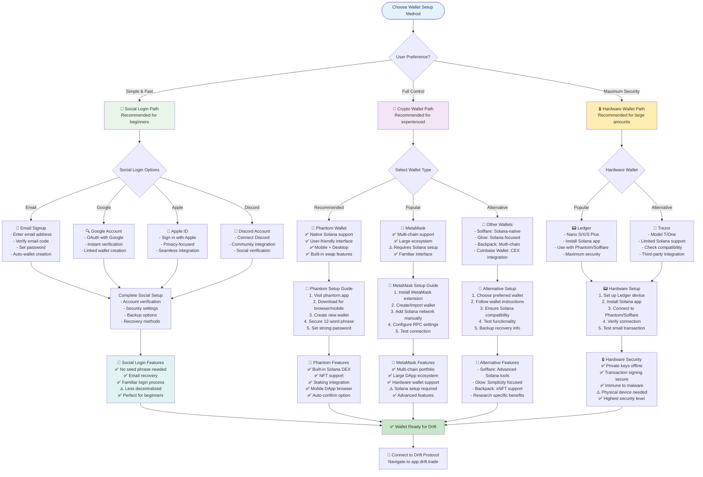
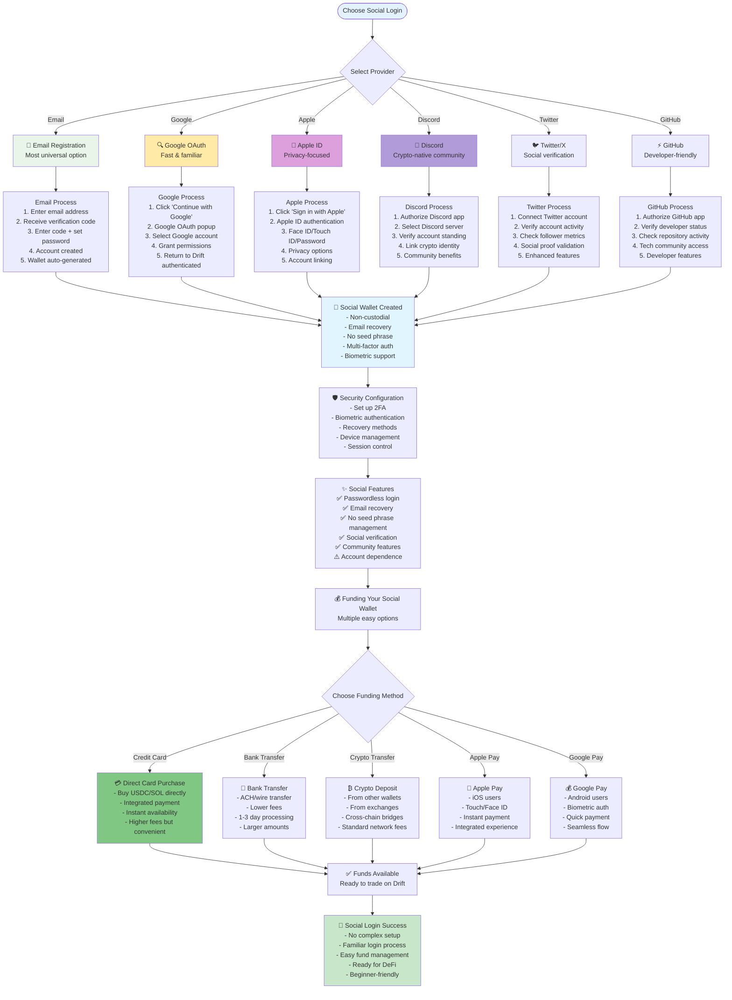

# Drift Protocol User Journey Flows - Complete Wallet Options

Based on official documentation from https://docs.drift.trade/ and https://app.drift.trade

## Journey 1: Perpetual Trading Flow (Complete Wallet Options)

```mermaid
flowchart TD
    Start([New User Wants to Trade Perps]) --> WalletCheck{Has Crypto Wallet?}
    
    WalletCheck -->|No| WalletChoice{Preferred Setup Method?}
    WalletCheck -->|Yes| WalletType{What Wallet Type?}
    
    WalletChoice -->|Easy & Fast| SocialLogin[🔐 Social Login<br/>- Email signup<br/>- Passwordless login<br/>- No seed phrase needed]
    WalletChoice -->|Full Control| CreateWallet[Create Crypto Wallet<br/>Choose wallet type]
    
    SocialLogin --> SocialSetup[Complete Social Setup<br/>- Verify email<br/>- Set up security<br/>- Auto-generate wallet]
    CreateWallet --> WalletOptions{Select Wallet}
    
    WalletOptions -->|Recommended| PhantomSetup[🦄 Phantom Wallet<br/>- Native Solana support<br/>- Browser extension<br/>- Mobile app available]
    WalletOptions -->|Popular| MetaMaskSetup[🦊 MetaMask<br/>- Multi-chain support<br/>- Add Solana network<br/>- Browser extension]
    WalletOptions -->|Advanced| OtherWallets[Other Wallets<br/>- Solflare<br/>- Glow<br/>- Ledger hardware]
    
    PhantomSetup --> PhantomSteps[Phantom Setup<br/>- Install extension<br/>- Create new wallet<br/>- Secure seed phrase]
    MetaMaskSetup --> MetaMaskSteps[MetaMask Setup<br/>- Install extension<br/>- Add Solana network<br/>- Import/create wallet]
    OtherWallets --> OtherSteps[Alternative Setup<br/>- Follow wallet instructions<br/>- Ensure Solana support]
    
    WalletType -->|Phantom| PhantomSteps
    WalletType -->|MetaMask| MetaMaskSteps
    WalletType -->|Other| OtherSteps
    WalletType -->|Social| SocialSetup
    
    SocialSetup --> CheckSOL{Has SOL for fees?}
    PhantomSteps --> CheckSOL
    MetaMaskSteps --> CheckSOL
    OtherSteps --> CheckSOL
    
    CheckSOL -->|No| GetSOLMethod{How to Get SOL?}
    CheckSOL -->|Yes| ConnectDrift[Connect to app.drift.trade]
    
    GetSOLMethod -->|Buy Direct| BuySOLDirect[Buy SOL Directly<br/>- In-wallet purchase<br/>- Credit card/bank<br/>- Built-in exchanges]
    GetSOLMethod -->|CEX Transfer| BuySOLCEX[CEX Method<br/>- Buy on Binance/Coinbase<br/>- Withdraw to wallet<br/>- Check network = Solana]
    GetSOLMethod -->|Bridge| BridgeAssets[Bridge from Other Chains<br/>- Use recommended bridges<br/>- Convert ETH/USDC to Solana<br/>- Cross-chain transfer]
    
    BuySOLDirect --> ConnectDrift
    BuySOLCEX --> ConnectDrift
    BridgeAssets --> ConnectDrift
    
    ConnectDrift --> WalletConnect[Connect Wallet to Drift<br/>- Click 'Connect Wallet'<br/>- Select your wallet type<br/>- Approve connection]
    
    WalletConnect --> AuthMethod{Authentication Method}
    AuthMethod -->|Wallet| SignMessage[Sign Connection Message<br/>- Verify wallet ownership<br/>- No fees for connection]
    AuthMethod -->|Social| SocialAuth[Social Authentication<br/>- Verify email/social<br/>- Automatic wallet linking]
    
    SignMessage --> AccountSetup[Account Setup<br/>- Pay 0.035 SOL setup fee<br/>- Initialize Drift account<br/>- Create subaccount]
    SocialAuth --> AccountSetup
    
    AccountSetup --> Deposit[Deposit Collateral<br/>- USDC recommended<br/>- SOL, BTC, ETH accepted<br/>- Min $100-500 suggested]
    
    Deposit --> DepositMethod{Deposit Method}
    DepositMethod -->|Direct| DirectDeposit[Direct Wallet Deposit<br/>- From connected wallet<br/>- Instant transfer<br/>- Gas fees apply]
    DepositMethod -->|CEX| CEXDeposit[CEX Withdrawal<br/>- Withdraw from exchange<br/>- To Drift wallet address<br/>- Check network compatibility]
    DepositMethod -->|Cross-chain| CrossChainDeposit[Cross-chain Bridge<br/>- Bridge tokens to Solana<br/>- Then deposit to Drift<br/>- Multi-step process]
    
    DirectDeposit --> CheckBalance[Verify Account Balance<br/>& Free Collateral]
    CEXDeposit --> CheckBalance
    CrossChainDeposit --> CheckBalance
    
    CheckBalance --> SelectMarket[Choose Perp Market<br/>- SOL-PERP popular<br/>- Analyze volume & funding<br/>- Check mark vs oracle price]
    
    SelectMarket --> PlanTrade[Plan Trade<br/>- Direction: Long/Short<br/>- Position size calculation<br/>- Leverage 1x-101x selection]
    
    PlanTrade --> OrderType{Select Order Type}
    OrderType -->|Market| PlaceMarket[Market Order<br/>- Immediate execution<br/>- Current market price<br/>- Set size & leverage]
    OrderType -->|Limit| PlaceLimit[Limit Order<br/>- Set target price<br/>- Set size & leverage<br/>- Wait for price trigger]
    OrderType -->|Advanced| PlaceAdvanced[Advanced Orders<br/>- Stop Loss/Take Profit<br/>- Trailing stops<br/>- Conditional orders]
    
    PlaceMarket --> ReviewOrder[Review Trade Summary<br/>- Entry price estimate<br/>- Trading fees ~0.1%<br/>- Margin requirement<br/>- Liquidation price]
    PlaceLimit --> ReviewOrder
    PlaceAdvanced --> ReviewOrder
    
    ReviewOrder --> ConfirmTrade[Confirm Transaction<br/>- Final review<br/>- Sign with wallet<br/>- Submit to network]
    
    ConfirmTrade --> JITAuction[🔄 5-Second JIT Auction<br/>Dutch auction mechanism<br/>Market makers compete<br/>Price improvement opportunity]
    
    JITAuction --> ExecutionPath{Execution Route}
    ExecutionPath -->|JIT Fill| JITFill[✅ JIT Market Maker Fill<br/>- Better than expected price<br/>- Instant execution<br/>- Optimal liquidity]
    ExecutionPath -->|DLOB Match| DLOBFill[✅ DLOB Limit Order Match<br/>- Matched with existing order<br/>- Fair price execution<br/>- Decentralized matching]
    ExecutionPath -->|AMM Fill| AMMFill[✅ AMM Backstop Fill<br/>- Guaranteed execution<br/>- AMM liquidity source<br/>- Constant availability]
    
    JITFill --> MonitorPosition[🎯 Position Active<br/>Monitor in Positions tab<br/>Real-time updates<br/>Mobile notifications available]
    DLOBFill --> MonitorPosition
    AMMFill --> MonitorPosition
    
    MonitorPosition --> TrackMetrics[📊 Track Real-time Metrics<br/>- Unrealized P&L<br/>- Mark price changes<br/>- Funding payments hourly<br/>- Account health status]
    
    TrackMetrics --> ManagePosition{Position Management?}
    ManagePosition -->|Adjust| AdjustOptions[⚙️ Adjustment Options<br/>- Increase position size<br/>- Reduce position size<br/>- Set stop-loss orders<br/>- Take profit targets]
    ManagePosition -->|Hold| ContinueMonitor[👀 Continue Monitoring<br/>- Watch market conditions<br/>- Monitor health ratio<br/>- Track funding rates]
    ManagePosition -->|Close| ClosePosition[🚪 Close Position<br/>- Full position close<br/>- Partial position close<br/>- Market or limit close]
    
    AdjustOptions --> TrackMetrics
    ContinueMonitor --> TrackMetrics
    ClosePosition --> SettlePNL[💰 Settle P&L<br/>- Calculate final P&L<br/>- Update account balance<br/>- Pay closing fees]
    
    SettlePNL --> WithdrawOption{Withdraw Funds?}
    WithdrawOption -->|Yes| WithdrawFunds[💸 Withdraw to Wallet<br/>- Back to connected wallet<br/>- Or to external address<br/>- Choose withdrawal amount]
    WithdrawOption -->|No| KeepFunds[💎 Keep in Drift<br/>- Available for next trade<br/>- Earn lending yield<br/>- Use as collateral]
    
    WithdrawFunds --> AnalyzePerformance[📈 Analyze Performance<br/>- Total return calculation<br/>- Fees breakdown<br/>- Time in position<br/>- Learning insights]
    KeepFunds --> AnalyzePerformance
    
    AnalyzePerformance --> Complete([✅ Trading Journey Complete<br/>Ready for next trade])
    
    style Start fill:#e3f2fd
    style Complete fill:#c8e6c9
    style SocialLogin fill:#e8f5e8
    style JITAuction fill:#fff3e0
    style ExecutionPath fill:#f3e5f5
    style MonitorPosition fill:#e1f5fe
```

## Wallet Setup Decision Flow

## Onboarding Flow with All Login Options

```mermaid
flowchart TD
    Landing([User Visits app.drift.trade]) --> LoginPrompt[Connect Wallet Button<br/>Multiple options available]
    
    LoginPrompt --> LoginChoice{Choose Login Method}
    
    LoginChoice -->|Fastest| Social[🔐 Social Login<br/>No wallet needed<br/>1-click signup]
    LoginChoice -->|Popular| Phantom[🦄 Phantom<br/>Recommended Solana wallet<br/>Best experience]
    LoginChoice -->|Multi-chain| MetaMask[🦊 MetaMask<br/>Connect existing wallet<br/>Multi-chain support]
    LoginChoice -->|Other| MoreWallets[⚙️ More Wallets<br/>20+ wallet options<br/>Choose your preference]
    
    Social --> SocialFlow[Social Authentication<br/>- Choose provider<br/>- Verify account<br/>- Auto-generate wallet<br/>- Skip seed phrase]
    
    Phantom --> PhantomFlow{Phantom Status?}
    PhantomFlow -->|Installed| PhantomConnect[Connect Phantom<br/>- Approve connection<br/>- Sign message<br/>- Access granted]
    PhantomFlow -->|Not Installed| PhantomInstall[Install Phantom<br/>- Redirect to phantom.app<br/>- Download extension<br/>- Setup new wallet<br/>- Return to Drift]
    
    MetaMask --> MetaMaskFlow{MetaMask Status?}
    MetaMaskFlow -->|Installed| MetaMaskCheck{Solana Network?}
    MetaMaskFlow -->|Not Installed| MetaMaskInstall[Install MetaMask<br/>- Redirect to metamask.io<br/>- Download extension<br/>- Setup wallet<br/>- Return to Drift]
    
    MetaMaskCheck -->|Configured| MetaMaskConnect[Connect MetaMask<br/>- Switch to Solana<br/>- Approve connection<br/>- Sign message]
    MetaMaskCheck -->|Need Setup| MetaMaskSetup[Setup Solana Network<br/>- Add network manually<br/>- Configure RPC<br/>- Test connection]
    
    MoreWallets --> WalletGrid[Wallet Selection Grid<br/>- Solflare<br/>- Glow<br/>- Backpack<br/>- Coinbase Wallet<br/>- Exodus<br/>- Trust Wallet<br/>- Slope<br/>- And 15+ more options]
    
    SocialFlow --> Authenticated[✅ Authenticated<br/>Social wallet created<br/>Ready to deposit]
    PhantomConnect --> Authenticated
    PhantomInstall --> PhantomConnect
    MetaMaskConnect --> Authenticated
    MetaMaskInstall --> MetaMaskSetup
    MetaMaskSetup --> MetaMaskConnect
    WalletGrid --> WalletConnect[Connect Selected Wallet<br/>Follow wallet-specific flow]
    WalletConnect --> Authenticated
    
    Authenticated --> OnboardingCheck{First Time User?}
    OnboardingCheck -->|Yes| Onboarding[🎓 Onboarding Experience<br/>- Welcome tutorial<br/>- Feature walkthrough<br/>- Risk warnings<br/>- Best practices<br/>- Demo trade option]
    OnboardingCheck -->|No| ExistingUser[👋 Welcome Back<br/>- Load user data<br/>- Check account health<br/>- Show portfolio<br/>- Recent activity]
    
    Onboarding --> AccountSetup[Account Initialization<br/>- Pay 0.035 SOL fee<br/>- Create subaccount<br/>- Set preferences<br/>- Choose default settings]
    ExistingUser --> Dashboard[📊 Dashboard Access<br/>Account overview loaded]
    
    AccountSetup --> FirstDeposit[💰 First Deposit Guide<br/>- Funding options<br/>- Minimum amounts<br/>- Supported assets<br/>- Step-by-step help]
    
    FirstDeposit --> DepositMethods{Funding Method?}
    DepositMethods -->|Wallet| WalletDeposit[Direct from Wallet<br/>- Select asset<br/>- Enter amount<br/>- Confirm transaction]
    DepositMethods -->|CEX| CEXGuide[CEX Withdrawal Guide<br/>- Popular exchanges<br/>- Withdrawal instructions<br/>- Network verification<br/>- Address verification]
    DepositMethods -->|Card| FiatOnRamp[💳 Buy Crypto Direct<br/>- Credit/debit card<br/>- Bank transfer<br/>- Integrated providers<br/>- Direct to Drift]
    DepositMethods -->|Bridge| BridgeGuide[🌉 Cross-chain Bridge<br/>- Supported networks<br/>- Bridge providers<br/>- Fee estimates<br/>- Step-by-step process]
    
    WalletDeposit --> FundsReady[✅ Funds Available<br/>Ready to trade]
    CEXGuide --> FundsReady
    FiatOnRamp --> FundsReady
    BridgeGuide --> FundsReady
    Dashboard --> FundsReady
    
    FundsReady --> TradingReady[🚀 Ready to Trade<br/>Choose your journey:<br/>- Perpetual trading<br/>- Liquidity provision<br/>- Lending/borrowing<br/>- Insurance staking]
    
    style Landing fill:#e3f2fd
    style TradingReady fill:#c8e6c9
    style Social fill:#e8f5e8
    style Phantom fill:#dda0dd
    style MetaMask fill:#ffa500
    style Onboarding fill:#fff3e0
    style FiatOnRamp fill:#e1f5fe
```

## Social Login Detailed Flow

---

## Implementation Notes

### New Wallet Support Features:
1. **Social Login Integration** - Passwordless authentication with major providers
2. **MetaMask Support** - Multi-chain wallet with Solana network setup
3. **Hardware Wallet Support** - Ledger and Trezor integration
4. **20+ Wallet Options** - Comprehensive wallet ecosystem support
5. **Fiat On-Ramps** - Direct credit card and bank transfer options

### Enhanced User Experience:
- **Smart Routing** - Users directed to best option based on preferences
- **Progressive Setup** - Start simple, add complexity as needed
- **Recovery Options** - Multiple backup and recovery methods
- **Cross-Platform** - Mobile and desktop support for all options

### Security Considerations:
- **Risk Education** - Clear warnings about different security models
- **Best Practices** - Guidance for each wallet type
- **Backup Emphasis** - Importance of proper backup procedures
- **Progressive Security** - Start simple, enhance over time

These updated flowcharts now comprehensively cover all authentication and wallet options that Drift Protocol supports, making the platform accessible to users across the entire spectrum from crypto beginners to advanced DeFi users.