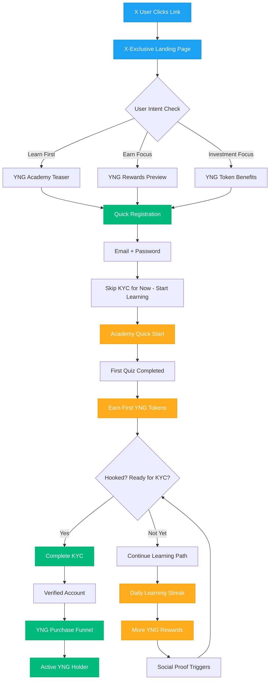

# X (Twitter) to YNG Token Conversion Funnel

## Strategic Conversion Path: X Discovery → YNG Investment → Active User

### Current Challenge Analysis
**Problem**: Users discover Young Platform on X but don't immediately convert to YNG token holders or active users.

**Opportunity**: X users are crypto-aware but need education and incentives to engage with YNG ecosystem.

## Conversion Funnel Strategy

### Stage 1: X Discovery & Initial Interest

#### **Current X Content Strategy Enhancement**
```
📱 X Content Types:
- Market analysis threads with YNG utility mentions
- Educational content with "Learn & Earn YNG" CTAs
- Success stories of YNG holders
- Live updates on The Unbox competition
- Behind-the-scenes content from team
- Regulatory compliance wins (trust building)
```

#### **Optimized X Content for YNG Conversion**
```
🧵 Thread Ideas:
1. "Why YNG is different from other exchange tokens"
2. "Real users earning €50+ monthly with YNG"
3. "5 ways YNG holders get premium benefits"
4. "From €20 to YNG millionaire - user journey"
5. "The Unbox: How YNG gives you better odds"
```

### Stage 2: From X Click to Landing Page

#### **Dedicated Landing Pages from X Traffic**
```
🎯 X-Specific Landing Pages:
- youngplatform.com/x-exclusive
- youngplatform.com/yng-starter
- youngplatform.com/learn-earn-x
```

#### **Landing Page Content Strategy**
```
📄 Hero Section:
"Earn YNG Tokens While Learning Crypto"
- Start with €20
- Earn tokens daily
- Join 1M+ users
- [Start Earning YNG] CTA

🎁 X-Exclusive Offer:
"First 100 X followers get 2x YNG rewards this month"
```

### Stage 3: Registration with YNG Focus

#### **Modified Onboarding for X Users**


### Stage 4: The "Learn-to-Earn" YNG Hook

#### **Immediate YNG Earning Opportunities**
```
🎯 Quick Wins (First 24 Hours):
1. Registration Bonus: 10 YNG tokens
2. First lesson complete: 5 YNG tokens  
3. First quiz passed: 10 YNG tokens
4. Profile completion: 5 YNG tokens
5. X account connection: 15 YNG tokens

Total: 45 YNG tokens (~€2-5 value)
```

#### **Daily Engagement Loop**
```
📱 Daily YNG Earning Activities:
- Academy lesson: 5-10 YNG
- Quiz completion: 10-15 YNG  
- Young Platform Step (walking): 5-20 YNG
- Social sharing: 5 YNG
- Discord participation: 5 YNG
- Market prediction game: 10-25 YNG

Weekly potential: 200-400 YNG tokens
```

### Stage 5: Social Proof & FOMO Triggers

#### **Real-Time Social Proof**
```
🔥 On-Platform Notifications:
"🎉 @CryptoUser just earned 50 YNG tokens!"
"💰 This week: 15,247 users earned YNG"
"⚡ Live: The Unbox competition - 2,431 participants"
"🏆 @YoungTrader won €500 with YNG benefits!"
```

#### **X Integration for Virality**
```
🐦 Auto-Generated X Posts:
"Just earned my first 100 YNG tokens on @youngplatform! 
🚀 Learning crypto + earning rewards = perfect combo
#YNG #CryptoEducation #LearnAndEarn"

[Auto-tweet with user permission]
```

### Stage 6: YNG Investment Funnel

#### **Progressive Investment Journey**
```
💰 Investment Pathway:
Week 1: Earn 50-100 YNG (learn value)
Week 2: Buy first €20 of YNG (small commitment)  
Week 3: Join Club Young Basic (see benefits)
Week 4: Dollar-cost average €50/month YNG
Month 2: Upgrade to Club Young Premium
Month 3: Participate in The Unbox with YNG boosts
```

#### **Smart Nudges & Timing**
```
🔔 Conversion Triggers:
- After earning 50 YNG: "Buy 50 more and unlock Club benefits"
- During market dips: "YNG is 15% off - perfect buying opportunity"
- Before competitions: "YNG holders get 2x tickets in The Unbox"
- Tax season: "YNG rewards help offset trading taxes"
```

### Stage 7: Active User Retention

#### **YNG Utility Maximization**
```
🎯 YNG Benefits Stack:
1. Fee Discounts: Up to 50% trading fee reduction
2. Exclusive Content: Premium market insights
3. Competition Advantages: Extra tickets, better odds
4. Early Access: New features, tokens, NFTs
5. Cashback: Up to 3.6% on Young Card
6. Governance: Vote on platform decisions
7. Staking Rewards: Earn more YNG passively
```

## Detailed Conversion Tactics

### **A. Content Marketing on X**

#### **Thread Series: "YNG Success Stories"**
```
🧵 Example Thread:
"How I turned my daily coffee money into €2,000 with YNG 🧵

1/ Started with just €20 and Young Platform Academy
2/ Earned 10-20 YNG daily through learning
3/ Used DCA to buy €30 YNG monthly  
4/ Joined Club Young for benefits
5/ Won €500 in The Unbox competition
6/ Now earning 3.6% cashback on everything
7/ Total portfolio value: €2,000+ 

Link to start: youngplatform.com/yng-starter"
```

#### **Daily Engagement Posts**
```
📱 Daily Post Ideas:
Monday: "YNG Monday Motivation - Show your learning streak!"
Tuesday: "Tech Tuesday - YNG utility deep dive"  
Wednesday: "Win Wednesday - The Unbox competition updates"
Thursday: "Throwback Thursday - YNG price journey"
Friday: "Feature Friday - New YNG benefits"
Saturday: "Saturday Spotlight - Community success stories"
Sunday: "Sunday Study - Academy lesson highlights"
```

### **B. Gamification & Competition**

#### **X-Exclusive Challenges**
```
🏆 Monthly X Challenges:
- "YNG Academy Challenge": Complete 20 lessons, win bonus YNG
- "Share & Earn": Tweet learning progress, earn extra tokens
- "Streak Master": 30-day learning streak = exclusive NFT
- "Referral Rocket": Bring 5 friends = premium Club access
```

#### **The Unbox Integration**
```
🎁 X User Advantages in The Unbox:
- Tweet about participation: +25% gem boost
- X follower milestone achievements: bonus tickets
- Create viral YNG content: premium rewards
- X Space participation: exclusive gem multipliers
```

### **C. Influencer & Community Strategy**

#### **Micro-Influencer Program**
```
🤝 X Influencer Tiers:
Nano (1K-10K): Free YNG, early access
Micro (10K-100K): Paid partnerships, custom codes
Macro (100K+): Brand ambassadorships, exclusive events

Each gets unique tracking codes for conversion attribution
```

#### **Community Building**
```
💬 X Community Tactics:
- Daily YNG earning leaderboards
- Weekly AMA with YNG holders
- Success story amplification  
- X Spaces about YNG ecosystem
- Real-time competition updates
```

### **D. Retargeting & Remarketing**

#### **Smart Retargeting Sequences**
```
🎯 Retargeting Funnel:
Day 1: Visited landing page → Educational content ad
Day 3: Started registration → "Complete and earn YNG" ad  
Day 7: Earned first YNG → "Buy more and unlock benefits" ad
Day 14: Active learner → "Join The Unbox competition" ad
Day 30: Regular user → "Upgrade to premium Club" ad
```

### **E. Data-Driven Optimization**

#### **Key Metrics to Track**
```
📊 Conversion Metrics:
- X click-through rate to landing pages
- Landing page to registration conversion
- Registration to first YNG earned
- First YNG earned to first YNG purchased  
- YNG purchase to Club Young membership
- Club membership to active monthly users

Target: 5% X users → Active YNG holders
```

#### **A/B Testing Strategy**
```
🧪 Test Variables:
- Landing page headlines
- CTA button text and colors
- YNG reward amounts
- Competition entry methods
- Social proof formats
- Video vs. text content
- Timing of conversion nudges
```

## Implementation Timeline

### **Phase 1: Foundation (Weeks 1-2)**
- Create X-specific landing pages
- Set up tracking and analytics
- Develop content calendar
- Launch learn-to-earn program

### **Phase 2: Content Amplification (Weeks 3-6)**  
- Daily valuable content on X
- Success story collection
- Influencer outreach
- Community challenges

### **Phase 3: Conversion Optimization (Weeks 7-10)**
- A/B testing campaigns
- Retargeting setup
- Funnel optimization
- Competition integration

### **Phase 4: Scale & Iterate (Weeks 11+)**
- Successful tactic scaling
- Advanced segmentation
- Premium features rollout
- International expansion

## Success Prediction Model

### **Conversion Rate Estimates**
```
🎯 Expected Conversion Rates:
X Impression → Landing Page: 2-4%
Landing Page → Registration: 8-15%  
Registration → First YNG Earned: 60-80%
First YNG Earned → YNG Purchase: 20-30%
YNG Purchase → Active User: 70-85%

Overall X → Active YNG User: 0.5-1.5%
With 100K X reach = 500-1,500 new active users
```

### **Revenue Impact**
```
💰 User Value Projection:
Average YNG holder spends: €200-500 initially
Monthly recurring: €50-150
Annual LTV: €1,000-2,500

1,000 converted users = €1M-2.5M revenue impact
```

This conversion funnel transforms passive X followers into engaged YNG token holders through education, gamification, and progressive commitment building. The key is making YNG earning immediate and valuable while building toward larger investments and platform engagement.

Would you like me to detail any specific part of this conversion strategy further?