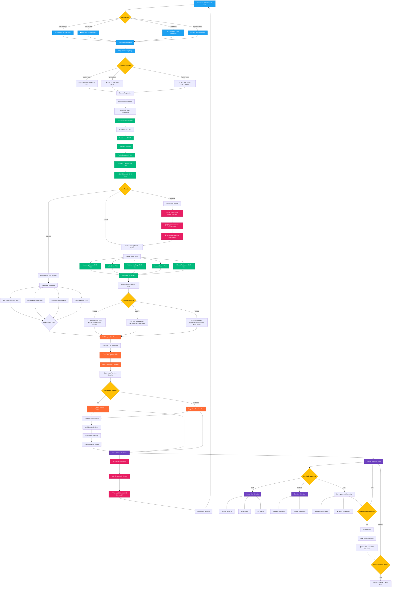
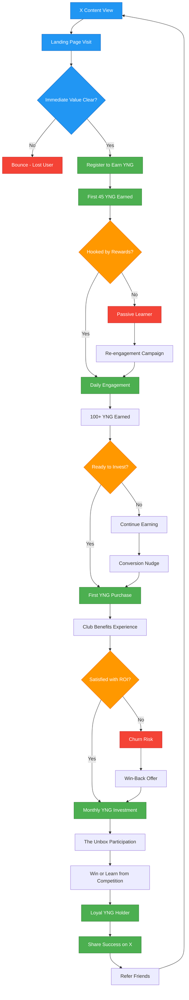

# X to YNG Token Conversion Flow - Optimized Funnel

## Strategic Conversion Mermaid Diagram

```mermaid
flowchart TD
    %% X Discovery Phase
    A[User Sees YNG Content on X] --> B{Content Type}
    B -->|Success Story| C["📈 'I earned €500 with YNG'"]
    B -->|Educational| D["🎓 'Learn crypto, earn YNG'"]
    B -->|Competition| E["🏆 'The Unbox - YNG advantage'"]
    B -->|Market Analysis| F["📊 'YNG utility explained'"]
    
    C --> G[Click X-Exclusive Link]
    D --> G
    E --> G
    F --> G
    
    %% Landing Page Optimization
    G --> H[X-Specific Landing Page]
    H --> I{User Intent Detection}
    I -->|Want to Learn| J["🎯 'Start Learning & Earning YNG'"]
    I -->|Want to Earn| K["💰 'Earn 45 YNG in 24 Hours'"]
    I -->|Want to Invest| L["🚀 'Buy YNG & Join Premium Club'"]
    
    %% Quick Registration Path
    J --> M[Express Registration]
    K --> M
    L --> M
    
    M --> N[Email + Password Only]
    N --> O[Skip KYC - Start Immediately]
    
    %% Immediate YNG Earning
    O --> P[Welcome Bonus: 10 YNG]
    P --> Q[Academy Quick Tour]
    Q --> R[First Lesson: 5 YNG]
    R --> S[First Quiz: 10 YNG]
    S --> T[Profile Complete: 5 YNG]
    T --> U[Connect X Account: 15 YNG]
    
    U --> V[45 YNG Earned - €2-5 Value]
    
    %% Engagement Loop
    V --> W{User Reaction}
    W -->|Excited| X[Daily Learning Streak Begins]
    W -->|Curious| Y[Explore More YNG Benefits]
    W -->|Skeptical| Z[Social Proof Triggers]
    
    %% Daily Engagement Path
    X --> AA[Daily Activities Menu]
    AA --> BB[Academy Lesson: 5-10 YNG]
    AA --> CC[Quiz: 10-15 YNG]
    AA --> DD[Walking Challenge: 5-20 YNG]
    AA --> EE[Social Share: 5 YNG]
    AA --> FF[Market Prediction: 10-25 YNG]
    
    BB --> GG[Daily Total: 35-75 YNG]
    CC --> GG
    DD --> GG
    EE --> GG
    FF --> GG
    
    %% Social Proof & FOMO
    Z --> HH["🔥 Live: '2,431 users earning YNG now'"]
    HH --> II["💰 '@CryptoUser earned 50 YNG today'"]
    II --> JJ["🏆 'YNG holders win 2x more prizes'"]
    JJ --> X
    
    %% Benefits Discovery
    Y --> KK[YNG Utility Showcase]
    KK --> LL[Fee Discounts: Save 50%]
    KK --> MM[Exclusive Content Access]
    KK --> NN[Competition Advantages]
    KK --> OO[Cashback up to 3.6%]
    
    LL --> PP{Ready to Buy YNG?}
    MM --> PP
    NN --> PP
    OO --> PP
    
    %% Investment Conversion
    GG --> QQ[Weekly Streak: 200-400 YNG]
    QQ --> RR{Conversion Trigger}
    
    RR -->|Week 1| SS["💡 'You earned 100 YNG! Buy 50 more for Club access'"]
    RR -->|Week 2| TT["📈 'YNG dipped 15% - perfect buying opportunity'"]
    RR -->|Week 3| UU["🎁 'The Unbox starts tomorrow - YNG holders get 2x tickets'"]
    
    PP --> VV[KYC Required for Purchase]
    SS --> VV
    TT --> VV
    UU --> VV
    
    VV --> WW[Complete KYC Verification]
    WW --> XX[First YNG Purchase: €20-50]
    
    %% Club Young Integration
    XX --> YY[Club Young Basic Unlocked]
    YY --> ZZ[Experience Premium Benefits]
    ZZ --> AAA{Satisfied with Benefits?}
    
    AAA -->|Yes| BBB[Monthly DCA: €50-150 YNG]
    AAA -->|Want More| CCC[Upgrade to Premium Club]
    
    %% Competition Integration
    BBB --> DDD[The Unbox Participation]
    CCC --> DDD
    
    DDD --> EEE[YNG Boosts: 2x Gems]
    EEE --> FFF[Higher Win Probability]
    FFF --> GGG[Prize Wins Build Loyalty]
    
    %% Active User Loop
    GGG --> HHH[Active YNG Holder Status]
    BBB --> HHH
    CCC --> HHH
    
    HHH --> III[Regular Platform Usage]
    III --> JJJ{Monthly Engagement}
    
    JJJ -->|High| KKK[Power User Benefits]
    JJJ -->|Medium| LLL[Standard Retention]
    JJJ -->|Low| MMM[Re-engagement Campaign]
    
    %% Viral Loop
    HHH --> NNN[Success Story Creation]
    NNN --> OOO[Auto-Generated X Content]
    OOO --> PPP["🐦 'Earned €200 with YNG this month!'"]
    PPP --> QQQ[Friends See Success]
    QQQ --> A
    
    %% Retention Strategies
    KKK --> RRR[Referral Rewards]
    KKK --> SSS[Beta Access]
    KKK --> TTT[VIP Events]
    
    LLL --> UUU[Educational Content]
    LLL --> VVV[Monthly Challenges]
    
    MMM --> WWW[Special YNG Bonuses]
    MMM --> XXX[Win-Back Competitions]
    MMM --> YYY{Re-engagement Success?}
    
    YYY -->|Yes| III
    YYY -->|No| ZZZ[Dormant User]
    
    %% Exit Prevention
    ZZZ --> AAAA[Final Value Proposition]
    AAAA --> BBBB["💰 'Your YNG earned €X this year'"]
    BBBB --> CCCC{Final Conversion Attempt}
    
    CCCC -->|Success| III
    CCCC -->|Fail| DDDD[Graceful Exit with Future Hooks]
    
    %% Styling
    classDef xContent fill:#1da1f2,stroke:#0d8bd9,color:#fff,stroke-width:2px
    classDef earning fill:#00ba7c,stroke:#00a96e,color:#fff,stroke-width:2px
    classDef conversion fill:#ff6b35,stroke:#e55a2b,color:#fff,stroke-width:2px
    classDef retention fill:#6f42c1,stroke:#5a2d91,color:#fff,stroke-width:2px
    classDef decision fill:#ffc107,stroke:#e0a800,color:#000,stroke-width:2px
    classDef social fill:#e91e63,stroke:#c2185b,color:#fff,stroke-width:2px
    
    class A,C,D,E,F,G,H xContent
    class P,R,S,T,U,V,BB,CC,DD,EE,FF,GG earning
    class VV,XX,YY,BBB,CCC conversion
    class HHH,III,KKK,LLL retention
    class B,I,W,RR,AAA,JJJ,YYY,CCCC decision
    class HH,II,JJ,NNN,OOO,PPP social
```

## Simplified X-to-YNG Success Path

```mermaid
flowchart LR
    A[X Discovery] --> B[Landing Page]
    B --> C[Quick Registration]
    C --> D[Earn First YNG]
    D --> E[Daily Learning Loop]
    E --> F[Social Proof]
    F --> G[Buy First YNG]
    G --> H[Club Benefits]
    H --> I[Competition Wins]
    I --> J[Active User]
    J --> K[Viral Sharing]
    K --> A
    
    classDef phase1 fill:#e3f2fd,stroke:#1976d2
    classDef phase2 fill:#f1f8e9,stroke:#388e3c  
    classDef phase3 fill:#fff3e0,stroke:#f57c00
    classDef phase4 fill:#fce4ec,stroke:#c2185b
    
    class A,B,C phase1
    class D,E,F phase2
    class G,H,I phase3
    class J,K phase4
```

## Key Conversion Moments Flow

```mermaid
flowchart TD
    A[X Content View] --> B[Landing Page Visit]
    B --> C{Immediate Value Clear?}
    C -->|No| D[Bounce - Lost User]
    C -->|Yes| E[Register to Earn YNG]
    
    E --> F[First 45 YNG Earned]
    F --> G{Hooked by Rewards?}
    G -->|No| H[Passive Learner]
    G -->|Yes| I[Daily Engagement]
    
    I --> J[100+ YNG Earned]
    J --> K{Ready to Invest?}
    K -->|No| L[Continue Earning]
    K -->|Yes| M[First YNG Purchase]
    
    M --> N[Club Benefits Experience]
    N --> O{Satisfied with ROI?}
    O -->|No| P[Churn Risk]
    O -->|Yes| Q[Monthly YNG Investment]
    
    Q --> R[The Unbox Participation]
    R --> S[Win or Learn from Competition]
    S --> T[Loyal YNG Holder]
    
    T --> U[Share Success on X]
    U --> V[Refer Friends]
    V --> A
    
    %% Recovery Paths
    H --> W[Re-engagement Campaign]
    W --> I
    
    L --> X[Conversion Nudge]
    X --> M
    
    P --> Y[Win-Back Offer]
    Y --> Q
    
    classDef success fill:#4caf50,stroke:#2e7d32,color:#fff
    classDef danger fill:#f44336,stroke:#c62828,color:#fff
    classDef warning fill:#ff9800,stroke:#ef6c00,color:#fff
    classDef info fill:#2196f3,stroke:#1565c0,color:#fff
    
    class E,F,I,M,Q,T,U success
    class D,H,P danger
    class G,K,O warning
    class A,B,C info
```