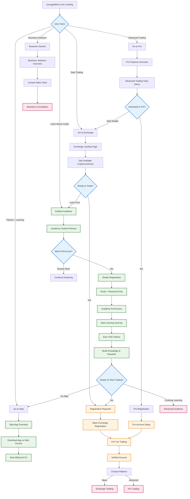
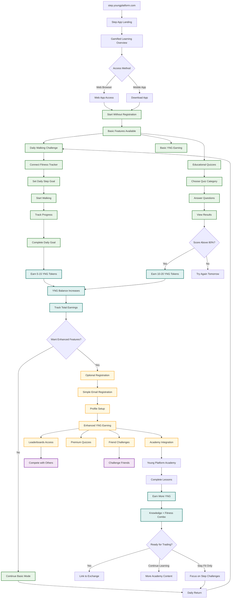
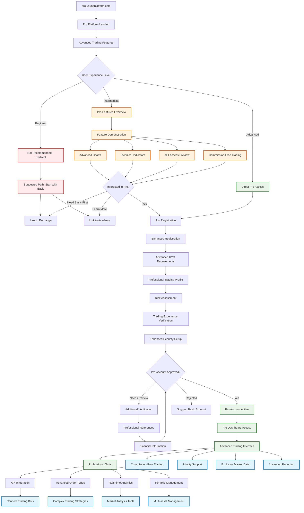
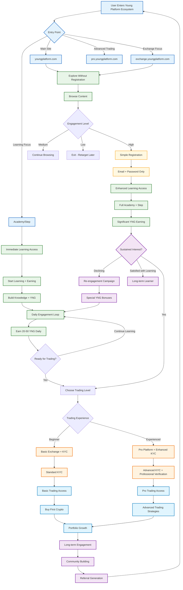

# Young Platform - Separate URL User Journey Flows

## Overview of Platform Architecture

### **No KYC Required (Immediate Access)**
- 🎓 **Academy**: Full educational content access
- 🚶 **Step**: Walking challenges, quizzes, basic YNG earning
- 📚 **Blog/Learning**: All educational resources
- 👥 **Community**: Discord, social features

### **KYC Required (Financial Services)**
- 💰 **Trading**: Buy/sell cryptocurrencies
- 💳 **Deposits/Withdrawals**: Fiat transactions
- 🏦 **Banking Features**: Payment cards, advanced features
- 🏢 **Business Services**: Corporate accounts

---

## 1. Main Website: youngplatform.com

---

## 2. Exchange: youngplatform.com/exchange/

```mermaid
flowchart TD
    A[youngplatform.com/exchange/] --> B[Exchange Landing Page]
    B --> C[Crypto Market Overview]
    C --> D[Real-time Prices Display]
    D --> E{User Action}
    
    E -->|Explore Without Account| F[Browse Markets]
    E -->|Learn First| G[Academy Link]
    E -->|Ready to Buy| H[Start Registration]
    
    %% Browse Without Account
    F --> I[View All Cryptocurrencies]
    I --> J[Price Charts & Analysis]
    J --> K[Market Information]
    K --> L{Convinced to Join?}
    
    L -->|Yes| H
    L -->|Need Education| G
    L -->|Not Ready| M[Continue Browsing]
    
    %% Education Path
    G --> N[Academy Preview]
    N --> O[No KYC Registration]
    O --> P[Learn Crypto Basics]
    P --> Q[Understanding Trading]
    Q --> R[Risk Management]
    R --> S[Ready to Trade Assessment]
    S --> T{Confidence Level}
    
    T -->|Ready| H
    T -->|Need More| U[Advanced Courses]
    U --> P
    
    %% Registration & Trading
    H --> V[Exchange Registration]
    V --> W[Email + Password]
    W --> X[Basic Profile Setup]
    X --> Y[KYC Verification Process]
    
    Y --> Z[Identity Documents]
    Z --> AA[Address Verification]
    AA --> BB[Selfie Verification]
    BB --> CC[AML/Compliance Check]
    CC --> DD{KYC Status}
    
    DD -->|Approved| EE[Account Verified]
    DD -->|Rejected| FF[Additional Documents]
    DD -->|Pending| GG[Wait for Review]
    
    FF --> Y
    GG --> HH[Notification When Ready]
    HH --> EE
    
    %% Verified User Experience
    EE --> II[Welcome to Exchange]
    II --> JJ[Deposit Options]
    JJ --> KK[Choose Deposit Method]
    KK -->|Bank Transfer| LL[SEPA Deposit]
    KK -->|Card Payment| MM[Card Deposit]
    KK -->|Other| NN[Alternative Methods]
    
    LL --> OO[Funds Available]
    MM --> OO
    NN --> OO
    
    OO --> PP[Select Cryptocurrency]
    PP --> QQ[Enter Purchase Amount]
    QQ --> RR[Review & Confirm]
    RR --> SS[Transaction Complete]
    SS --> TT[Crypto in Wallet]
    
    %% Post-Purchase Experience
    TT --> UU{Next Steps}
    UU -->|HODL| VV[Portfolio Tracking]
    UU -->|Trade More| WW[Additional Trading]
    UU -->|Learn More| XX[Continue Education]
    UU -->|Advanced Features| YY[Consider Pro Upgrade]
    
    classDef nokyc fill:#e8f5e8,stroke:#2e7d32,stroke-width:2px
    classDef kyc fill:#fff3e0,stroke:#f57c00,stroke-width:2px
    classDef trading fill:#e1f5fe,stroke:#0277bd,stroke-width:2px
    classDef decision fill:#f3e5f5,stroke:#7b1fa2,stroke-width:2px
    
    class F,I,J,K,G,N,O,P,Q,R nokyc
    class Y,Z,AA,BB,CC,EE kyc
    class OO,PP,QQ,RR,SS,TT trading
    class E,L,T,DD,UU decision
```

---

## 3. Step App: step.youngplatform.com/

---

## 4. Pro Platform: pro.youngplatform.com/

---

## 5. Cross-Platform User Journey Integration

## Key Insights from Separate Platform Flows:

### **🎓 Maximum Learning Without Barriers**
- **Academy & Step**: Full access without KYC
- **YNG Earning**: Start immediately with basic registration
- **Knowledge Building**: Complete courses before trading decisions

### **💰 Progressive Trading Commitment**
- **Basic Exchange**: Standard KYC for simple trading
- **Pro Platform**: Enhanced verification for advanced features
- **Business Solutions**: Corporate-level verification

### **🔄 Smart Cross-Platform Movement**
- Users can start anywhere and move between platforms
- Learning achievements carry across platforms
- YNG tokens earned in Step/Academy useful for trading benefits

### **📈 Conversion Optimization**
- No barriers to education and basic earning
- Natural progression from learning to trading
- Multiple re-engagement opportunities without forcing KYC

This approach maximizes user engagement and education before requiring any verification, leading to more informed and committed users when they do decide to trade.