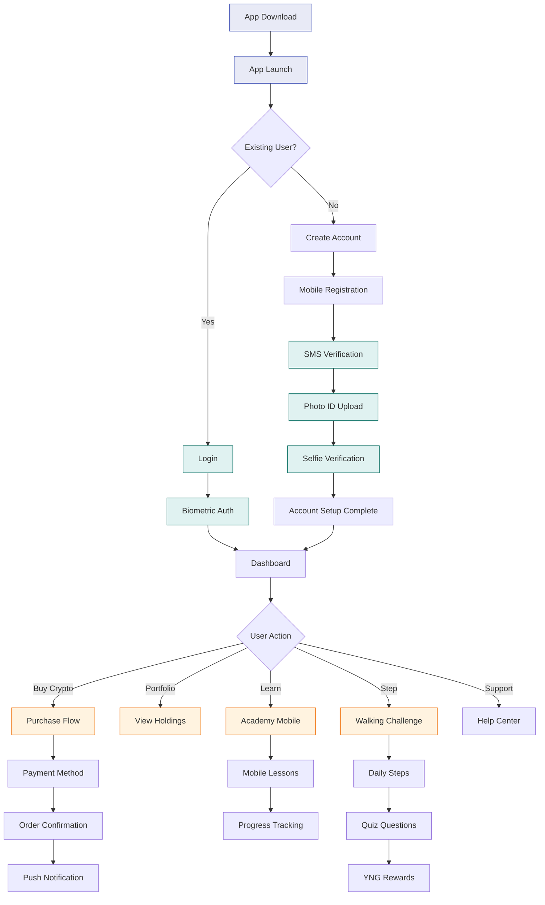
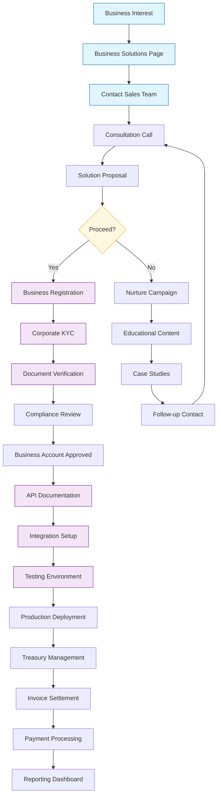

# Young Platform User Flow - Mermaid Diagram

## Complete User Journey Flow

```mermaid
flowchart TD
    %% Awareness Stage
    A[User Discovers Young Platform] --> B{How did they discover?}
    B -->|Social Media| C[X/Twitter @youngplatform]
    B -->|Community| D[Discord Community]
    B -->|Content| E[Blog/Educational Content]
    B -->|Word of Mouth| F[Friend Referral]
    B -->|Search| G[Google Search Results]
    
    C --> H[Visit Website]
    D --> H
    E --> H
    F --> H
    G --> H
    
    %% Consideration Stage
    H --> I{User Type?}
    I -->|Complete Beginner| J[Explore Educational Content]
    I -->|Some Experience| K[Compare Features & Fees]
    I -->|Business User| L[Review Business Solutions]
    
    J --> M[Young Platform Academy Preview]
    J --> N[Security & Regulation Info]
    K --> O[Young Platform Pro Features]
    K --> P[Fee Structure Analysis]
    L --> Q[Business Services Overview]
    L --> R[Corporate Solutions]
    
    M --> S{Ready to Start?}
    N --> S
    O --> S
    P --> S
    Q --> S
    R --> S
    
    S -->|No| T[Subscribe to Newsletter]
    S -->|Maybe| U[Join Discord Community]
    S -->|Yes| V[Click Register Button]
    
    T --> END1[Exit - Future Engagement]
    U --> END2[Community Member - Future Conversion]
    
    %% Registration & Onboarding
    V --> W[Registration Form]
    W --> X[Email & Password Setup]
    X --> Y[Terms & Privacy Acceptance]
    Y --> Z[Email Verification]
    Z --> AA[Account Created]
    
    AA --> BB[Welcome Screen]
    BB --> CC[Choose User Type]
    CC -->|Individual| DD[Personal Account Setup]
    CC -->|Business| EE[Business Account Setup]
    
    %% KYC Process
    DD --> FF[Start KYC Verification]
    EE --> FF
    FF --> GG[Upload ID Document]
    GG --> HH[Address Verification]
    HH --> II[Selfie Verification]
    II --> JJ[AML/Sanctions Check]
    JJ --> KK{KYC Status}
    
    KK -->|Approved| LL[Account Verified]
    KK -->|Rejected| MM[Provide Additional Documents]
    KK -->|Pending| NN[Wait for Review]
    
    MM --> FF
    NN --> OO[Email Notification When Ready]
    OO --> LL
    
    %% Security Setup
    LL --> PP[Mandatory 2FA Setup]
    PP --> QQ[Choose 2FA Method]
    QQ -->|SMS| RR[Phone Number Verification]
    QQ -->|App| SS[Authenticator App Setup]
    RR --> TT[2FA Enabled]
    SS --> TT
    
    %% Onboarding Experience
    TT --> UU[Platform Tour Starts]
    UU --> VV[Feature Overview]
    VV --> WW[Security Best Practices]
    WW --> XX[Educational Resources Introduction]
    XX --> YY{User Preference}
    
    YY -->|Learn First| ZZ[Young Platform Academy]
    YY -->|Start Trading| AAA[First Deposit Flow]
    YY -->|Explore| BBB[Platform Exploration]
    
    %% Learning Path
    ZZ --> CCC[Blockchain Fundamentals]
    CCC --> DDD[Cryptocurrency Basics]
    DDD --> EEE[Trading Introduction]
    EEE --> FFF[Risk Management]
    FFF --> GGG[Complete Basic Course]
    GGG --> HHH[Earn YNG Tokens]
    HHH --> III{Ready to Trade?}
    
    III -->|Yes| AAA
    III -->|Continue Learning| JJJ[Advanced Courses]
    JJJ --> ZZ
    
    %% First Deposit & Purchase
    AAA --> KKK[Choose Deposit Method]
    KKK -->|Bank Transfer| LLL[SEPA Transfer]
    KKK -->|Card Payment| MMM[Credit/Debit Card]
    KKK -->|Mobile Payment| NNN[Mobile Payment Method]
    
    LLL --> OOO[Enter Bank Details]
    MMM --> PPP[Enter Card Details]
    NNN --> QQQ[Select Mobile Provider]
    
    OOO --> RRR[Confirm Transfer]
    PPP --> SSS[Process Card Payment]
    QQQ --> TTT[Mobile Payment Auth]
    
    RRR --> UUU[Wait for Bank Transfer]
    SSS --> VVV[Instant Deposit]
    TTT --> VVV
    
    UUU --> WWW[Deposit Received Notification]
    WWW --> VVV
    
    VVV --> XXX[Funds Available]
    XXX --> YYY[Choose Cryptocurrency]
    YYY -->|Bitcoin| ZZZ[BTC Purchase Flow]
    YYY -->|Ethereum| AAAA[ETH Purchase Flow]
    YYY -->|Other| BBBB[Altcoin Selection]
    
    ZZZ --> CCCC[Enter Purchase Amount]
    AAAA --> CCCC
    BBBB --> CCCC
    
    CCCC --> DDDD[Review Order]
    DDDD --> EEEE[Confirm Purchase]
    EEEE --> FFFF[Transaction Processing]
    FFFF --> GGGG[Purchase Complete]
    GGGG --> HHHH[Crypto in Wallet]
    
    %% Regular Usage Paths
    HHHH --> IIII{Next Action?}
    IIII -->|Hold| JJJJ[Portfolio Monitoring]
    IIII -->|Trade More| KKKK[Additional Purchases]
    IIII -->|Learn| LLLL[Continue Education]
    IIII -->|Advanced Features| MMMM[Upgrade to Pro]
    
    %% Portfolio Management
    JJJJ --> NNNN[View Portfolio Performance]
    NNNN --> OOOO[Price Alerts Setup]
    OOOO --> PPPP[Market Analysis]
    PPPP --> QQQQ{Market Action?}
    
    QQQQ -->|Buy More| KKKK
    QQQQ -->|Sell| RRRR[Sell Orders]
    QQQQ -->|Hold| SSSS[Continue Monitoring]
    
    %% Advanced Features
    MMMM --> TTTT[Young Platform Pro]
    TTTT --> UUUU[Advanced Trading Interface]
    UUUU --> VVVV[Technical Analysis Tools]
    VVVV --> WWWW[API Access]
    WWWW --> XXXX[Professional Trading]
    
    %% Community Engagement
    LLLL --> YYYY[Young Platform Step]
    YYYY --> ZZZZ[Daily Walking Challenge]
    ZZZZ --> AAAAA[Quiz Participation]
    AAAAA --> BBBBB[Earn YNG Tokens]
    BBBBB --> CCCCC[Club Young Benefits]
    
    CCCCC --> DDDDD{Club Level?}
    DDDDD -->|Basic| EEEEE[Standard Benefits]
    DDDDD -->|Premium| FFFFF[Enhanced Benefits]
    DDDDD -->|VIP| GGGGG[Exclusive Access]
    
    %% Business Users Path
    BBB --> HHHHH{Explore Business Features?}
    HHHHH -->|Yes| IIIII[Business Dashboard]
    HHHHH -->|No| JJJJ
    
    IIIII --> JJJJJ[Corporate Treasury]
    JJJJJ --> KKKKK[Invoice Settlement]
    KKKKK --> LLLLL[Payment Processing]
    LLLLL --> MMMMM[Sub-accounts Setup]
    MMMMM --> NNNNN[Business API Integration]
    
    %% Support & Issues
    KKKK --> OOOOO{Need Help?}
    RRRR --> OOOOO
    SSSS --> OOOOO
    XXXX --> OOOOO
    NNNNN --> OOOOO
    
    OOOOO -->|Yes| PPPPP[Support Channels]
    OOOOO -->|No| QQQQQ[Continue Usage]
    
    PPPPP -->|Self-Service| RRRRR[Help Center/FAQ]
    PPPPP -->|Live Support| SSSSS[Chat Support]
    PPPPP -->|Complex Issue| TTTTT[Email Ticket]
    
    RRRRR --> UUUUU[Issue Resolved?]
    SSSSS --> UUUUU
    TTTTT --> UUUUU
    
    UUUUU -->|Yes| QQQQQ
    UUUUU -->|No| VVVVV[Escalate to Phone Support]
    VVVVV --> QQQQQ
    
    %% Retention & Loyalty
    QQQQQ --> WWWWW[Regular Platform Usage]
    WWWWW --> XXXXX{Engagement Level?}
    
    XXXXX -->|High| YYYYY[Power User Benefits]
    XXXXX -->|Medium| ZZZZZ[Standard Engagement]
    XXXXX -->|Low| AAAAAA[Re-engagement Campaign]
    
    YYYYY --> BBBBBB[Referral Program]
    YYYYY --> CCCCCC[Beta Feature Access]
    ZZZZZ --> DDDDDD[Educational Content]
    AAAAAA --> EEEEEE[Special Offers]
    
    %% Tax & Compliance
    WWWWW --> FFFFFF{Tax Season?}
    FFFFFF -->|Yes| GGGGGG[Generate Tax Report]
    FFFFFF -->|No| WWWWW
    
    GGGGGG --> HHHHHH[Download Fiscal Report]
    HHHHHH --> IIIIII{Need Professional Help?}
    IIIIII -->|Yes| JJJJJJ[Accountant Consultation]
    IIIIII -->|No| KKKKKK[Self-File Taxes]
    
    %% Exit Scenarios
    AAAAAA --> LLLLLL{Re-engage Success?}
    LLLLLL -->|Yes| WWWWW
    LLLLLL -->|No| MMMMMM[Account Dormancy]
    
    MMMMMM --> NNNNNN[Final Re-engagement Attempt]
    NNNNNN --> OOOOOO{User Response?}
    OOOOOO -->|Active| WWWWW
    OOOOOO -->|Inactive| PPPPPP[Account Closure Process]
    
    PPPPPP --> QQQQQQ[Asset Withdrawal]
    QQQQQQ --> RRRRRR[Account Deactivation]
    RRRRRR --> SSSSSS[Exit Survey]
    SSSSSS --> TTTTTT[Data Retention Policy]
    
    %% Competition Participation
    BBBBB --> UUUUUU[The Unbox Competition]
    UUUUUU --> VVVVVV[Complete Missions]
    VVVVVV --> WWWWWW[Earn Gems]
    WWWWWW --> XXXXXX[Get Lottery Tickets]
    XXXXXX --> YYYYYY[Prize Drawing]
    YYYYYY --> ZZZZZZ[Win Prizes/Young Card]
    
    %% Styling
    classDef startEnd fill:#e1f5fe,stroke:#01579b,stroke-width:2px
    classDef process fill:#f3e5f5,stroke:#4a148c,stroke-width:2px
    classDef decision fill:#fff3e0,stroke:#e65100,stroke-width:2px
    classDef action fill:#e8f5e8,stroke:#1b5e20,stroke-width:2px
    classDef error fill:#ffebee,stroke:#c62828,stroke-width:2px
    
    class A,END1,END2,TTTTTT startEnd
    class B,I,S,KK,YY,III,IIII,QQQQ,DDDDD,HHHHH,OOOOO,UUUUU,XXXXX,FFFFFF,IIIIII,LLLLLL,OOOOOO decision
    class H,V,W,FF,UU,AAA,YYYY,IIIII,PPPPP,GGGGGG,UUUUUU process
    class HHHH,XXXX,QQQQQ,WWWWW action
    class MM,VVVVV error
```



## Simplified Core User Flow

```mermaid
flowchart TD
    A[Landing Page Visit] --> B{User Intent}
    B -->|Learn| C[Academy Content]
    B -->|Trade| D[Registration]
    B -->|Business| E[Business Solutions]
    
    C --> F[Educational Journey]
    F --> G[Quiz & Rewards]
    G --> H[Ready to Trade?]
    H -->|Yes| D
    H -->|No| I[Continue Learning]
    
    D --> J[Email Signup]
    J --> K[KYC Verification]
    K --> L[2FA Setup]
    L --> M[Account Verified]
    
    M --> N[First Deposit]
    N --> O[Choose Crypto]
    O --> P[Make Purchase]
    P --> Q[Crypto in Wallet]
    
    Q --> R{Next Steps}
    R -->|HODL| S[Portfolio Tracking]
    R -->|Trade More| T[Additional Trading]
    R -->|Advanced| U[Upgrade to Pro]
    R -->|Community| V[Join Clubs]
    
    E --> W[Business Onboarding]
    W --> X[Corporate KYC]
    X --> Y[Business Features]
    Y --> Z[API Integration]
    
    classDef start fill:#e3f2fd,stroke:#1565c0
    classDef process fill:#f1f8e9,stroke:#388e3c
    classDef decision fill:#fff8e1,stroke:#f57c00
    classDef end fill:#fce4ec,stroke:#c2185b
    
    class A start
    class B,H,R decision
    class D,K,L,N,O,P,W,X process
    class Q,S,T,U,V,Y,Z end
```

## Mobile App User Flow



## Business User Flow

